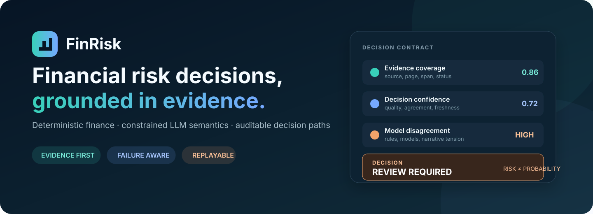
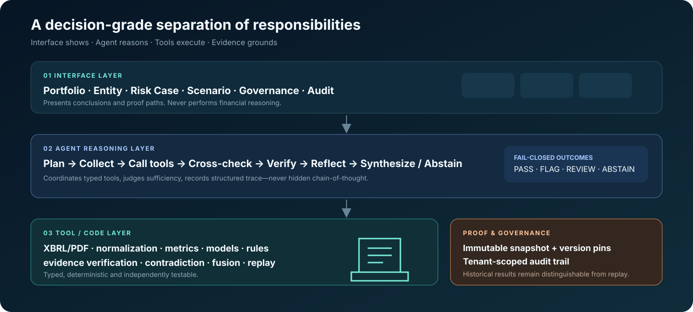
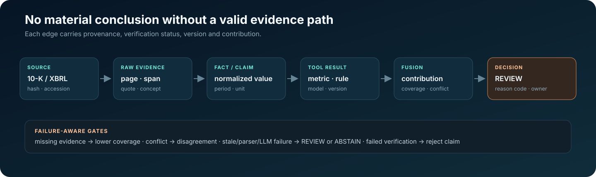
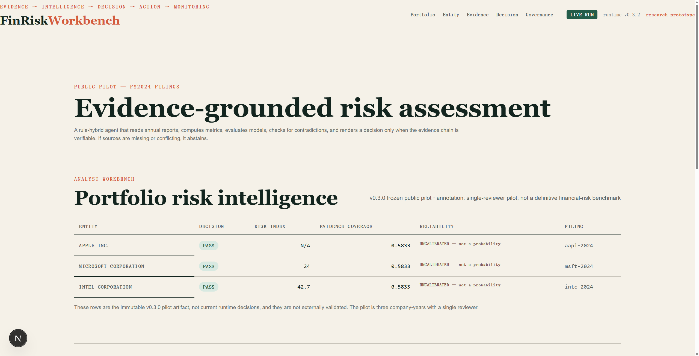
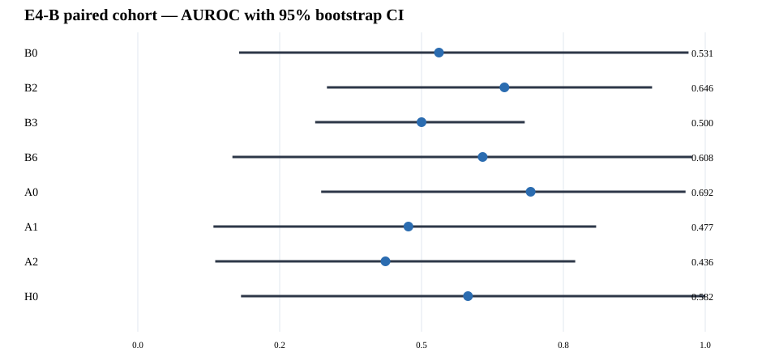
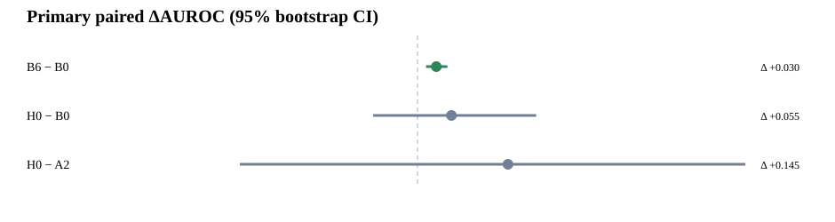

<div align="center">



# FinRisk

### Enterprise Financial Risk Intelligence & Management — Research Prototype

[](https://github.com/siqiwang0712-commits/financial-risk-agent/actions/workflows/ci.yml)
[](https://www.python.org/)
[](https://fastapi.tiangolo.com/)
[](https://nextjs.org/)
[](LICENSE)

**An evidence-grounded financial risk platform where an Agent orchestrates, a constrained LLM interprets, deterministic financial tools execute, and every material conclusion must trace back to verified evidence.**

[Quick start](#quick-start) · [Architecture](#architecture) · [Research results](#research-results) · [Workbench](#analyst-workbench) · [Documentation](#documentation)

</div>

> [!IMPORTANT]
> **FinRisk is a research prototype.** The 0–100 risk index is an expert-designed heuristic. It is not a bankruptcy probability, credit rating, fraud finding, or investment recommendation.
>
> **Risk severity ≠ evidence coverage ≠ evidence quality ≠ model disagreement ≠ reliability ≠ probability.** These are separate quantities and are never collapsed into one another. Reliability is reported `UNCALIBRATED`.
>
> No production deployment, external validation, or regulatory approval is claimed. See [Limitations](research/limitations.md).

## Release target

**v0.3.4 — Hardened Boundaries & Verified Release Runtime** closes the v0.3.x architecture and runtime hardening work: the API, Agent and tool registry share one configured pipeline; document analysis runs behind a killable process boundary; external SEC, LLM and evidence inputs fail closed; and both candidate and operator-facing Compose paths verify the exact container digest before promotion. The v0.3.3 digest example below remains a historical verified record; read the v0.3.4 digest from the release workflow output after promotion.

- [CHANGELOG](CHANGELOG.md) — complete release history
- [v0.3.4 release notes](RELEASE_NOTES_v0.3.4.md) — scope and unchanged research boundary
- [Reproducibility and runtime integrity](docs/reproducibility_runtime_integrity.md) — replay, persistence and trust boundaries

## Why FinRisk exists

Annual reports, 10-Ks and 20-Fs scatter material evidence across XBRL facts, statements, footnotes, MD&A, risk factors and auditor language. An analyst must reconcile periods, units and restatements; calculate metrics consistently; test management claims against the numbers; and preserve a defensible source trail.

An unconstrained LLM is the wrong financial-risk oracle. It may transpose columns, lose units, improvise arithmetic, accept optimistic narrative, or produce an unsupported conclusion. FinRisk instead treats the LLM as a **fallible semantic sensor** inside a controlled system:

| Responsibility | System owner | Invariant |
|---|---|---|
| Authoritative numbers and normalization | XBRL + deterministic code | Preserve unit, period, filing and restatement provenance |
| Ratios, trends, scenarios and model formulas | Deterministic tools | Independently reproducible and tested |
| MD&A, notes and audit-language interpretation | Schema-constrained LLM | Semantic extraction only; never final scoring |
| Risk patterns and thresholds | Versioned rules and policy | Inspectable, replayable and organization-scoped |
| Material conclusions | Failure-aware fusion + verification | No valid evidence path → `REVIEW` or `ABSTAIN` |

> **Financial arithmetic belongs to deterministic systems. Semantic interpretation belongs to a constrained LLM. Decisions belong to an auditable evidence path.**

## What you can do

- Ingest SEC Company Facts / inline XBRL and page-aware annual-report PDFs.
- Normalize values across currency, scale, period, taxonomy and restatement candidates.
- Compute liquidity, leverage, profitability, cash-flow, working-capital and trend metrics.
- Run Altman Z, Beneish M, Piotroski F and Ohlson O with explicit applicability checks.
- Evaluate 68 versioned expert rules without scattering thresholds through application code.
- Verify quotations against cited pages before admitting them as evidence.
- Fuse risk using weighted-average, max-severity, hierarchical or interaction-aware strategies.
- Replay an assessment from frozen inputs and versions, then show any output drift.
- Gate automation on evidence coverage, explicit reliability/calibration status and disagreement.

## Quick start

Prerequisites: Python >=3.11 (release gate tests 3.11 and 3.12), Node.js 22+, npm 10+, Docker Desktop (optional).

### Backend

```bash
python -m venv .venv
source .venv/bin/activate          # Windows PowerShell: .venv\Scripts\Activate.ps1
python -m pip install -e ".[dev]"
uvicorn finrisk.api:app --reload
```

API documentation is available at `http://localhost:8000/docs`; liveness is at `http://localhost:8000/health/live` and readiness at `http://localhost:8000/health/ready` (`/health` remains as a compatibility alias for readiness).

### Frontend

```bash
cd frontend
npm ci
npm run dev
```

Open `http://localhost:3000`.

### Docker Compose

```bash
docker compose up --build
```

The development compose file uses an explicitly development-only database password. For the production overlay, provide a non-default secret; migrations run as a one-shot service before the API starts:

```bash
POSTGRES_PASSWORD='<strong-secret>' docker compose -f docker-compose.yml -f docker-compose.prod.yml up --build
```

`POSTGRES_PASSWORD` is only applied when the PostgreSQL volume is **first** initialised.
Changing it afterwards does not change the password stored in the existing volume, so
the containers stop authenticating. The PostgreSQL healthcheck authenticates over TCP,
so this shows up as `unhealthy` (not as a healthy database plus a crashing API).
The probe deliberately connects to the container's own address on the
Compose network rather than to `127.0.0.1`: the image ships
`host all all 127.0.0.1/32 trust` *above* the `scram-sha-256` rule it appends, so a
loopback probe succeeds with any password, including a wrong one.

How the mismatch surfaces depends on when the API has to open a **new** connection:

- **New connection by a running API.** `/health/ready` answers `503` naming the
  rejected credential while `/health/live` stays `200`. Rotating the password inside
  a live database is *not* immediately visible, though: PostgreSQL does not terminate
  established sessions, so an API holding pooled connections keeps answering `200`
  until those sessions break — a server restart, a pool grow, or a lifetime expiry.
  Do not read a `200` right after an `ALTER USER` as proof that the rotation was safe.
- **Start-up with a mismatched password.** The API does not reach request handling at
  all: it builds its connection pool while the app module is imported, and that pool
  readiness wait gives up after 10 s by raising `psycopg_pool.PoolTimeout` (a bare
  timeout — it does not name the credential), so the container exits and **neither
  `/health/live` nor `/health/ready` answers**. Rotate (or recreate the volume)
  *before* a cold start rather than expecting a `503` from it.
- Under Compose the API is gated on `service_healthy`, so an unhealthy database stops
  `up` before the API container is even created.

To rotate the credential, change it inside the database first:

```bash
docker compose exec postgres psql -U finrisk -d finrisk -c "ALTER USER finrisk WITH PASSWORD '<new-secret>'"
```

or recreate the volume with `down -v`, which **destroys the stored data**.

`Strict-Transport-Security` is sent only when the request actually arrives over TLS
(`https`, or an `x-forwarded-proto: https` terminator). On a plain-HTTP stack the
header is omitted rather than advertising a guarantee the deployment does not provide;
put TLS in front and it takes effect automatically.

### Container (GHCR) quick start

Pre-built images live on GitHub Container Registry. No toolchain, no build step:

```bash
cp .env.release.example .env    # then edit it — see the table below
docker compose -f docker-compose.release.yml pull
docker compose -f docker-compose.release.yml up -d
```

Use `.env.release.example`, **not** `.env.example`: the latter targets the source build
and leaves organisation bootstrap disabled, which on a fresh database means there is no
way to create the first administrator.

The API answers on `http://127.0.0.1:8000`, the Workbench on `http://127.0.0.1:3000`.
Every port is bound to loopback on purpose — put a TLS terminator in front for remote
access. PostgreSQL runs as the official `postgres:17-alpine` image and is not
repackaged; migrations run as a one-shot service from the API image before the API
starts.

**First run.** The stack starts in `FINRISK_ENV=production`, where the bootstrap route
is token-gated. A fresh database has no organisation and no API key, and bootstrap is
the only provisioning path, so you must set **both** `FINRISK_ENABLE_ORG_BOOTSTRAP=1`
and a non-empty `FINRISK_BOOTSTRAP_TOKEN` before the first `up -d`:

```bash
curl -sS -X POST http://127.0.0.1:8000/api/v1/enterprise/organizations \
  -H 'Content-Type: application/json' \
  -H "X-Bootstrap-Token: $FINRISK_BOOTSTRAP_TOKEN" \
  -d '{"name":"Acme","actor_id":"admin"}'      # returns api_key — store it, it is shown once
```

Then set `FINRISK_ENABLE_ORG_BOOTSTRAP=0`, clear the token and `up -d` again: the route
mints ADMIN keys without an API key of its own and must not stay reachable.

If you only want to run the stack and not develop it, two files are enough — no clone,
no toolchain:

```bash
curl -O https://raw.githubusercontent.com/siqiwang0712-commits/financial-risk-agent/main/docker-compose.release.yml
curl -o .env https://raw.githubusercontent.com/siqiwang0712-commits/financial-risk-agent/main/.env.release.example
$EDITOR .env
docker compose -f docker-compose.release.yml up -d
```

For a reproducible deployment pin the images rather than taking `main`'s defaults — see
the **Image identity** note below, and
[`docs/CONTAINER_RELEASE.md`](docs/CONTAINER_RELEASE.md) for the full release model.

| variable | required | why |
|---|---|---|
| `POSTGRES_PASSWORD` | yes | Applied when the volume is **first** initialised; see the rotation note above. |
| `FINRISK_LLM_PROVIDER` | yes | Fail-closed: unset is an error. Use `openai` for a real run; `mock` is a deterministic test provider, not a default. |
| `OPENAI_API_KEY` / `OPENAI_API_KEY_FILE` | when the provider needs one | Prefer the `_FILE` form (see below). |
| `FINRISK_ENABLE_ORG_BOOTSTRAP` | optional | Defaults to `0`; the route mints ADMIN keys without an API key. Set to `1` only for first-run provisioning, then back to `0`. |
| `FINRISK_BOOTSTRAP_TOKEN` / `..._FILE` | with bootstrap enabled | Gates the route that mints ADMIN keys. |

Secrets are mounted as files, not passed through the environment: `<VAR>_FILE` wins
over `<VAR>` when set, so the value never appears in `docker inspect` or in a shell
history. Supported for `DATABASE_URL`, `OPENAI_API_KEY` and `FINRISK_BOOTSTRAP_TOKEN`.

Rate limits are shared through PostgreSQL whenever `DATABASE_URL` is set, so the window
survives a restart and holds across replicas; the in-process window is only the local
fallback. Three optional settings bound datastore latency, and each falls back to its
default on an unusable value: `FINRISK_DATABASE_OPERATION_TIMEOUT_SECONDS` (default
`5.0`, how long a request waits for a pooled connection before a controlled `503`),
`FINRISK_DB_RECONNECT_TIMEOUT_SECONDS` (default `5.0`, replacing the pool's 300-second
reconnection window) and `FINRISK_DB_CONNECT_TIMEOUT_SECONDS` (default `5`, the libpq
handshake ceiling). None of them is related to the 60-second analysis timeout.

**Image identity.** `v0.3.3` and `latest` are tags; only the digest is the artifact:

```bash
docker compose -f docker-compose.release.yml up -d        # convenience
FINRISK_VERSION=sha-432732def9b9a947eadeee8edcd7c3e6a9cd7990 ...   # source identity
FINRISK_API_IMAGE=ghcr.io/siqiwang0712-commits/financial-risk-agent-api:v0.3.3@sha256:44135b1d5faaa02336dd8e16f426d663cc61207c600f5f034d72e02539a70698 ...
```

To verify what you pulled actually came from this repository's release workflow:

```bash
gh attestation verify oci://ghcr.io/siqiwang0712-commits/financial-risk-agent-api@sha256:44135b1d5faaa02336dd8e16f426d663cc61207c600f5f034d72e02539a70698 \
  -R siqiwang0712-commits/financial-risk-agent
```

`latest` is convenience only and is never a reproducibility reference. How the images
are built, verified and attested is documented in [`docs/CONTAINER_RELEASE.md`](docs/CONTAINER_RELEASE.md),
including how to find the digest of the release you are deploying.

### Run the synthetic offline demo

```powershell
$env:PYTHONPATH="backend"
python scripts/run_demo.py
```

The included company fixture is explicitly `synthetic`. It validates mechanics, not real-world performance.

### Reproducing the research

The consolidated [experiment overview](research/EXPERIMENT_OVERVIEW.md),
[results summary](research/EXPERIMENT_RESULTS.md), and
[reproducibility guide](research/EXPERIMENT_REPRODUCIBILITY.md) describe the
current v0.3.4/E4 evidence, public artifacts and replay boundaries.

Verify the checked-in E4 public result surface and run the current research
tests without regenerating frozen predictions or labels:

```bash
python scripts/verify_e4_public_artifacts.py
python -m pytest -q tests/test_e4.py tests/test_e4_posthoc.py tests/test_e4_public_release.py
```

Historical v0.3.1 artifacts remain available for audit but are no longer part
of the current release test gate or primary research presentation.

Rebuilding SEC snapshots requires an identifying User-Agent, and importing official bulk data expects the ZIP in `data/sec-bulk`:

```powershell
$env:SEC_USER_AGENT="FinRisk-Agent your-email@example.com"
python scripts/build_public_benchmark.py
```

```bash
python scripts/import_sec_bulk.py
SEC_USER_AGENT="Researcher Name researcher@example.edu" python scripts/acquire_empirical_corpus.py
```

SEC acquisition has three explicit routes: official `companyfacts.zip` or Financial Statement Data Set ZIPs, a local/offline cache, and the rate-limited live API fallback. Raw bulk files are intentionally Git-ignored.

A previously recorded live Company Facts rebuild received HTTP 403. That is preserved as a real failure, not replaced with synthetic "live" data. Full methodology lives in the [dataset card](research/dataset_card.md) and [evaluation protocol](research/evaluation_protocol.md).

## Documentation

| Topic | Document |
|---|---|
| Architecture and enterprise boundary | [Enterprise platform](docs/enterprise_platform.md) |
| Decision trace, replay, governance and threat model | [Decision-grade controls](docs/decision_grade_controls.md) |
| Reproducibility, replay and deployment maturity | [Reproducibility and runtime integrity](docs/reproducibility_runtime_integrity.md) |
| Three-layer migration | [Migration map](docs/three_layer_migration.md) |
| Temporal risk design | [Temporal risk intelligence](docs/temporal_risk_intelligence.md) |
| Risk Case lifecycle | [Enterprise workflow](docs/risk_case_workflow.md) |
| Capability truth table | [Capability maturity matrix](docs/capability_maturity_matrix.md) |
| Flagship real-data walkthrough | [Case Study 001 — Intel FY2024](docs/case_study_001.md) |
| Release history | [CHANGELOG](CHANGELOG.md) |
| Implemented / partial / not-implemented inventory | [PROJECT_STATUS](PROJECT_STATUS.md) |
| E4 cohort, data and endpoint protocol | [E4 study protocol](research/e4/protocol/STUDY_PROTOCOL.md) |
| Experiment index and evidence status | [Experiment overview](research/EXPERIMENT_OVERVIEW.md) |
| Cross-study result summary | [Experiment results](research/EXPERIMENT_RESULTS.md) |
| Frozen replay and artifact policy | [Experiment reproducibility](research/EXPERIMENT_REPRODUCIBILITY.md) |
| Evaluation design | [Evaluation protocol](research/evaluation_protocol.md) |
| Results and negative findings | [Results](research/results.md) |
| Error analysis | [Error analysis](research/error_analysis.md) |
| Research limitations | [Limitations](research/limitations.md) |
| Human–AI study | [Study protocol](research/human_ai_study_protocol.md) |

## Architecture



The three layers enforce a strict dependency boundary:

1. **Interface Layer** — FastAPI and the Next.js Workbench present data, workflow and proof. They do not calculate financial risk.
2. **Agent Reasoning Layer** — the planner and orchestrator select typed tools, assess sufficiency, cross-check signals, verify claims, reflect, and synthesize or abstain.
3. **Tool / Code Layer** — ingestion, normalization, metrics, models, rules, evidence, contradiction detection, fusion and replay execute deterministically.

`FinRiskPipeline` owns the shared rules, scoring policy, narrative provider and evidence verifier used by the API, Agent and tool registry. The Agent orchestrates that pipeline; it does not replace the deterministic calculation and decision path.

```text
User
  ↓
Interface ── Portfolio · Entity · Risk Case · Scenario · Governance · Audit
  ↓
Agent ───── Understand → Plan → Collect → Execute → Cross-check → Verify → Reflect
  ↓                                      ↓
Tools ───── XBRL/PDF · Metrics · Models · Rules · Evidence · Fusion · Replay
  ↓
Verified evidence graph → PASS / FLAG / REVIEW / ABSTAIN
```

Only structured execution metadata is retained: plan step, tool name, status, result summary, evidence references, rationale and confidence. Hidden chain-of-thought is neither stored nor displayed.

### Agent tool registry

| Tool family | Capabilities |
|---|---|
| Ingestion | PDF extraction, XBRL normalization, period and unit reconciliation |
| Financial | ratios, trends, period comparison, missing-data detection, scenarios |
| Models | Altman, Beneish, Piotroski, Ohlson, applicability checks |
| Rules | versioned single-factor and cross-factor risk signals |
| Evidence | retrieval, quote verification, provenance graph construction |
| Consistency | narrative–numeric support, tension and contradiction classification |
| Decision | signal calculation, policy resolution, fusion, snapshot and replay |
| Temporal | entity risk state, evidence delta, attribution and filing timeline |
| Governance | applicability, selective automation, critic/verifier and DecisionBundle |

Unknown tools, malformed arguments and missing required inputs fail closed.

## Evidence is the product



```text
document → page/section/span → extracted fact or claim → metric/rule/model
         → fusion contribution → risk dimension → final decision
```

A decision trace records reason code, document hash, accession, source page or XBRL concept, rule/model/prompt/fusion versions, confidence, coverage, disagreement and contribution. Evidence states remain explicit:

- `UNVERIFIED` — proposed but not confirmed at the cited location.
- `LOCATED` — extracted from a source location but not reconciled.
- `VERIFIED` — matched to the cited report evidence.
- `REJECTED` — verification failed; the claim cannot influence the result.

Conflicting top-ranked facts are not silently selected. Missing values are never replaced with zero. Broken paths trigger review or abstention.

### Deterministic replay

Each analysis can freeze its inputs into an immutable snapshot: input hash, document version, policy and rule versions, prompt/model version, fusion strategy, configuration and timestamp.

Replay creates a separate result and diff; it never overwrites the historical decision. That makes four audit questions answerable. Was the source document different? Did a threshold, model, prompt or fusion strategy change? Is the result byte-for-byte reproducible? Which decision path changed, and why?

See [Decision-grade controls](docs/decision_grade_controls.md).

### Risk is an evolving state

FinRisk models a filing as an update from `R(t-1)` to `R(t)`, not an isolated score. `RiskDelta` separates dimension, metric and evidence changes, and attaches each attribution driver to evidence-path identifiers. The temporal graph adds `SUPPORTS`, `CONTRADICTS`, `SUPERSEDES`, `DERIVED_FROM`, `CONFIRMS`, `WEAKENS` and `INVALIDATES` relationships.

This capability is code-complete and fixture-tested, and its structured temporal score was externally exercised as B6 in E4. The Agent's own `risk_trajectory` field is derived from the current run only: the single-process local path does not persist history, so it reports `insufficient_history` unless a snapshot store supplies prior periods. Real multi-period document/evidence attribution quality remains **NOT VALIDATED**.

## Analyst Workbench



The Workbench follows the analyst's path rather than a chat metaphor:

```text
Portfolio → Entity → Risk Case → Risk Drivers → Evidence
          → Scenario → Governance → Audit
```

It keeps severity, trajectory, evidence coverage, decision confidence and model disagreement visually separate. Risk findings can become owned cases with reviewer status, due dates, actions, comments and an audited human override.

When the API upstream is unreachable, the Workbench falls back to a bundled sample and labels its origin on screen. That sample is a real pipeline output for the repository's synthetic fixture, not a hand-written mock-up, so a review never opens on an empty shell.

> The screenshot is from the local prototype. It is not evidence of a hosted production deployment.

## Research results

For the current E4 evidence-status map and artifact index, see the
[experiment overview](research/EXPERIMENT_OVERVIEW.md) and
[cross-study results](research/EXPERIMENT_RESULTS.md).

### E4 external validation

E4 evaluates the locked `v0.3.4` implementation on **2,000 company-disjoint FY2024 10-K filers** selected before outcomes were visible. The predefined financial-deterioration endpoint verified 674 companies (235 events; prevalence 34.9%). Performance estimates apply to the deterministically verifiable subset, not to bankruptcy, default, credit loss or insolvency probability.

Evidence status: B6 over B0 is `ESTABLISHED_E4`; H0 over B0 and H0 over A2 are `EXPLORATORY_E4`.

B6 achieved AUROC **0.708** (95% CI 0.663–0.750) and PR-AUC 0.584, compared with B0 AUROC 0.678 (0.633–0.721) and PR-AUC 0.541.



### Comparative benchmark

All rows below use the same E4-B paired, verified observations. Agent failures remain in coverage and are not imputed.

| System | N / events | AUROC (95% CI) | PR-AUC (95% CI) | Recall | Specificity | Coverage |
|---|---:|---:|---:|---:|---:|---:|
| B0 | 18 / 5 | 0.531 (0.179–0.971) | 0.500 (0.111–0.889) | 0.400 | 0.923 | 100.0% |
| B2 | 18 / 5 | 0.646 (0.333–0.906) | 0.389 (0.156–0.785) | 0.800 | 0.385 | 100.0% |
| B3 | 18 / 5 | 0.500 (0.312–0.682) | 0.333 (0.125–0.571) | 1.000 | 0.231 | 100.0% |
| B6 | 18 / 5 | 0.608 (0.167–0.977) | 0.544 (0.159–0.917) | 0.200 | 1.000 | 100.0% |
| A0 | 18 / 5 | 0.692 (0.323–0.965) | 0.459 (0.173–0.889) | 1.000 | 0.000 | 100.0% |
| A1 | 18 / 5 | 0.477 (0.133–0.808) | 0.299 (0.118–0.660) | 1.000 | 0.000 | 100.0% |
| A2 | 16 / 5 | 0.436 (0.136–0.771) | 0.343 (0.142–0.705) | 1.000 | 0.000 | 88.9% |
| H0 | 16 / 5 | 0.582 (0.182–1.000) | 0.604 (0.153–1.000) | 0.600 | 0.364 | 88.9% |

### Incremental value

P1 showed a positive paired AUROC improvement for B6 over B0: Δ +0.030 (95% CI +0.014 to +0.048; Holm-adjusted p=0.0015).

P2 H0 versus B0 (Δ +0.055, 95% CI -0.071 to +0.191) and P3 H0 versus A2 (Δ +0.145, -0.286 to +0.527) were exploratory and the paired improvements were not established.



### Local Agent benchmark

The benchmark communicated with a locally hosted Agent through an HTTP API. No external hosted inference API was used.

The frozen CPU backend was Qwen2.5 0.5B Instruct (Q4_K_M) through Ollama 0.12.3. Agent and H0 estimates are exploratory because only five verified events were available in the fully paired E4-B subset. The Agent produced five permanent schema failures across the 150 official A0/A1/A2 records; these remain coverage failures. Stability runs at fixed temperature and seed had zero score SD among successful cases, while single-case versus batched inference showed material score sensitivity despite high decision agreement. This finding applies only to the tested 0.5B Local Agent and does not establish that stronger LLMs or Agents lack incremental value.

### Post-hoc Codex sub-Agent comparator

`ChatGPT5.6 Sol` is the project-internal display name for a Codex sub-Agent comparator; it is not an OpenAI model name or official ChatGPT model, and the platform did not expose the exact underlying model ID. On the same 50 frozen anonymous E4-B packets it completed 150/150 A0/A1/A2 judgments. Only 18 cases had deterministic `VERIFIED` outcomes and only five were events: AUROC was 0.815 for A0, 0.800 for A1, 0.738 for A2, and 0.708 for the fixed `0.5 × B6 + 0.5 × A2` hybrid. These outcome-blind predictions were commissioned after E4 outcomes existed, so all results are `POST_HOC`, `UNCALIBRATED`, and insufficiently powered; they do not alter E4 or establish model superiority. Full traceability and results are in [the comparator methodology](research/e4_posthoc/model_capacity/sol_codex_agent/METHODOLOGY.md).

### E4-R Automated Robustness Study

`research/e4r_automated_robustness/` is a **POST_HOC** retrospective study run on E4's published replication data. It **does not modify E4**, **does not create confirmatory evidence**, **does not replace E5**, and evaluates robustness and competitive baselines only.

On the same 675 verified observations (235 events), it asks whether B6's temporal improvement is robust and whether conventional tabular learning can explain or beat it.

| Scorer | Out-of-fold AUROC | PR-AUC |
|---|---:|---:|
| B0 (frozen heuristic) | 0.679 | 0.541 |
| B6 (frozen heuristic) | 0.705 | 0.581 |
| Logistic, static only | 0.827 | 0.769 |
| Logistic, static + temporal (prespecified linear challenger) | 0.819 | 0.754 |
| Gradient boosting, static + temporal (prespecified nonlinear challenger) | 0.885 | 0.839 |

Findings, all `POST_HOC_AUTOMATED_ROBUSTNESS`:

- B6 > B0 reproduces: ΔAUROC **+0.0264**, paired DeLong p = 0.0014, Holm-adjusted p = 0.0014, 20,000-replicate BCa 95% CI **[+0.011, +0.043]**.
- The gain is entirely temporal: `B6_no_temporal` is `0.75 × B0`, so its AUROC equals B0's **exactly**, and removing the temporal block removes the whole separation.
- The gain is **not** concentrated in one term. The largest single-term effect (revenue growth) is 41% of the temporal gain, and dropping the cash-growth term slightly *improves* AUROC.
- B6 is **not competitive** here: the prespecified boosting challenger beats it by **+0.180** AUROC (Δ 95% CI [+0.139, +0.224]; the DeLong p underflows double precision at z = 8.39), and a logistic model on the four temporal features alone already reaches 0.805.
- The aggregate result is not uniformly robust: `Transportation_Utilities` shows ΔAUROC(B6−B0) = −0.005, while no single observation deletion reverses the sign.
- No confirmed leakage. Two checks are disclosed as `REVIEW`, not leakage: the endpoint is a transition rule anchored on pre-cutoff levels, and missingness indicators are themselves predictive.

Reproduce with `python research/e4r_automated_robustness/verify_e4r.py`. Full protocol, artifacts and the generated report are in [the study directory](research/e4r_automated_robustness/README.md) and [FINAL_REPORT.md](research/e4r_automated_robustness/FINAL_REPORT.md).

### Robustness and data integrity

All eight SEC archives passed SHA-256, CRC, required-member and size checks. Verified endpoint coverage was 33.7%; 571 cases required human review and 755 had insufficient outcome data. Prediction-time diagnostics show that verification was selective, so propensity weighting is post-hoc sensitivity analysis only and does not remove selection bias. Independent SEC–Zenodo processing/source concordance matched within 5% for 90.9% of 17,757 matched values; this is not extraction accuracy. Deterministic replay was canonical byte-identical.

### Research boundary

E4 evaluates structured financial risk ranking, temporal structured signal, Local Agent reasoning, and a deterministic + Agent structured hybrid. It does **not** validate calibrated default probability, universal bankruptcy prediction, production or regulatory use, a full narrative/document Agent, MD&A or Risk-Factor grounding, or full FinRisk Agent external validation. All systems remain `UNCALIBRATED`.

Full frozen methods and results are in [E4 Validation Report](research/e4/public/VALIDATION_REPORT.md) and [E4 Conclusion](research/e4/public/CONCLUSION.md). The post-completion limitations and sensitivity audit is in [E4 Post-completion Audit](research/e4_posthoc/AUDIT_REPORT.md).

### Historical studies

Earlier pilot and v0.3.1 experiments remain preserved as historical audit records, but they are retired from the current test gate and primary result surface. Current claims and release verification are based on the locked v0.3.4/E4 artifacts described above.

## Project maturity

| Status | What it means here |
|---|---|
| **VALIDATED — limited research scope** | Automated tests and ≥90% coverage gate; Ruff, TypeScript and production frontend build; deterministic finance fixtures; the locked 2,000-company E4 cohort; and E4 public-artifact integrity. B6 over B0 is established only on the 674 deterministically verified E4 outcomes. |
| **IMPLEMENTED, NOT EXTERNALLY VALIDATED** | XBRL/PDF reconciliation, temporal state/attribution, applicability routing, selective automation, constrained provider, critic/verifier, DecisionBundle, risk-case mitigation workflow, RBAC/API keys, PostgreSQL migrations and Workbench |
| **PLANNED / NOT RUN** | Human-adjudicated document/evidence benchmark, prospectively frozen stronger-model comparison, calibrated risk model, production identity/object storage/worker/telemetry deployment |

## API surface

Unauthenticated:

| Endpoint | Purpose |
|---|---|
| `GET /health/live` | Process liveness; never touches the database |
| `GET /health/ready` | Readiness: datastore reachability, credential acceptance and the schema sentinels; `GET /health` is a compatibility alias |
| `GET /api/v1/public-pilot` | Frozen v0.3.0 public-pilot rows served from the checked-in artifact |

Authenticated with `X-API-Key` (rate-limited per tenant/user):

| Endpoint | Purpose |
|---|---|
| `POST /api/v1/assess` | Assess normalized current/prior financial data and optional page text |
| `POST /api/v1/agent/assess` | Run the full Agent workflow over the same inputs |
| `POST /api/v1/documents/analyze` | Validate and analyze a PDF upload |
| `POST /api/v1/xbrl/normalize` | Normalize SEC Company Facts with provenance |

`/api/v1/enterprise` (tenant-scoped; identity and role come from the server-side hashed credential, never from caller headers):

| Endpoint | Purpose |
|---|---|
| `POST /organizations` | First-run provisioning: gated by `FINRISK_ENABLE_ORG_BOOTSTRAP` and, in production, by `X-Bootstrap-Token`; mints the first ADMIN key |
| `POST /entities` | Register a tenant-owned entity; `GET /overview` returns the portfolio roll-up |
| `POST /risk-cases`, `GET /risk-cases` | Create and list risk cases derived from a server-held snapshot |
| `POST /risk-cases/{id}/transition · override · actions · resolution-evidence · reopen` | Lifecycle, reason-required human override, mitigation actions and reopen |
| `POST /policies`, `POST /policies/{id}/evaluate` | Versioned KRI thresholds and their evaluation |
| `POST /snapshots`, `POST /snapshots/{id}/replay-diff` | Import a snapshot and diff a replayed output against it |
| `POST /entities/{id}/risk-snapshots`, `GET /entities/{id}/risk-timeline` | Temporal risk state and delta timeline |
| `POST /applicability · selective-decision · fusion · scenarios` | Model applicability, selective automation, fusion strategies and stress scenarios |
| `GET /audit-events` | Append-only audit trail for the tenant |

Every failure answers `{"detail": "…"}` with an `X-Correlation-Id` header; middleware-generated `500` and `503` bodies additionally carry a `correlation_id` field, and `503` responses from a datastore outage carry `Retry-After`. Validation failures answer `422` with a JSON-serialisable error body rather than a `500`. Machine-readable error codes and a response envelope are not yet provided: `422` covers several distinct rejection reasons under one message.

PDF uploads validate magic bytes and configurable limits (`FINRISK_MAX_UPLOAD_BYTES`, `FINRISK_MAX_PDF_PAGES`, `FINRISK_MAX_EXTRACTED_CHARS`, `FINRISK_ANALYSIS_TIMEOUT_SECONDS`); the historical `FINRISK_MAX_UPLOAD_MB` name is still honoured as a fallback when the bytes form is unset. Opening, page counting and page-text scanning run in a killable child process rather than the async event loop.

Invalid, encrypted, oversized or timed-out inputs fail closed, and temporary files are
removed. Analysis runs in a killable child process in every environment — not only in
production — so a timeout terminates the expensive pipeline instead of leaving it running
after the request has already answered. Internet-facing deployment still needs production
identity, malware scanning, a distributed worker system for scale and operational
validation.

The default narrative provider is deterministic and offline. To enable the schema-constrained real provider, copy `.env.example`, set `FINRISK_LLM_PROVIDER=openai`, configure `OPENAI_API_KEY`, and pin model pricing if cost estimates are needed. Tests never require a live API.

## Financial reasoning

Liquidity, leverage, debt service, profitability, cash flow, working capital and multi-period growth are calculated from normalized inputs. Where prior-year values exist, balance-based return and working-capital metrics use average balances; single-period proxies are labelled.

| Model | Output | Guardrail |
|---|---|---|
| Altman Z | distress screening zone | public-manufacturer applicability checks |
| Beneish M | manipulation-risk screening signal | never presented as fraud proof |
| Piotroski-style F-Score proxy | nine-signal financial-strength proxy | limited, non-canonical implementation; original value-stock context disclosed |
| Ohlson O | O-score and separately derived logistic probability | input-domain and unit warnings |

Model mappings are configured in [config/model_scoring.json](config/model_scoring.json).

[rules/rules.json](rules/rules.json) contains 68 versioned definitions covering
single-factor and cross-factor patterns. Runtime enables 43 with real producers; the 25
legacy definitions lacking legitimate producers are explicitly disabled with reasons in
[rules/disabled_rules.json](rules/disabled_rules.json). Startup and CI reject any other
unproducible condition. Correlated rules carry family metadata so scoring and proof
coverage both retain only the strongest applicable family signal.

Missing evidence, low coverage, conflicting evidence, stale data, parser failure, unavailable LLMs, applicability failures and rule/model disagreement are all first-class states. Depending on pinned policy, they reduce evidence sufficiency, increase review requirements, or force abstention. They never produce fabricated certainty.

The incident-style [Failure Lab](failure_lab/README.md) maps each injected failure to its impact, expected fail-closed response and regression test.

## Repository map

```text
financial-risk-agent/
├── backend/finrisk/       # domain, tools, agent, services and REST API
├── frontend/              # Next.js analyst Workbench
├── config/                # scoring, model and policy configuration
├── rules/                 # 68 versioned expert rules
├── tests/                 # unit, security, replay and integration tests
├── research/              # protocol, frozen pilot, ablations and errors
├── docs/                  # architecture, controls, threat model and assets
├── examples/              # explicitly synthetic fixtures and sample report
├── scripts/               # demo, benchmark and data-build entry points
├── portfolio/             # technical narrative and interview materials
├── docker-compose.yml
└── PROJECT_STATUS.md
```

## Verification

```bash
# With DATABASE_URL set, apply the migrations first: the suite assumes the schema
# already exists and does not create it. On a fresh database `rate_limit_events` is
# missing, the limiter fails closed and every authenticated route answers 503.
python scripts/validate_postgres_migration.py
pytest --cov=finrisk --cov-report=term-missing --cov-fail-under=90
ruff check backend tests scripts
```

```bash
cd frontend
npm audit --omit=dev --audit-level=high --registry=https://registry.npmjs.org
npm test
npm run typecheck
npm run build
```

The release gate covers Python 3.11 and 3.12 with a 90% minimum coverage threshold, Ruff, frontend semantic tests, a CI-enforced official-registry production dependency audit, TypeScript, the Next.js production build, prospective provenance validation and v0.3.4/E4 public-artifact verification.

## Security and governance

- Organization-scoped repositories and service checks enforce tenant boundaries.
- Enterprise API credentials are hashed server-side; caller-supplied role headers are not trusted.
- Human overrides retain original decision, new decision, actor, reason and timestamp.
- Model, prompt, rule, fusion and policy versions are recorded for formal runs.
- Credentials, `.env`, private reports, uploads, caches, generated assessments and local builds are ignored.

These are implemented controls in a prototype, not certification claims. Review the [threat model and readiness boundary](docs/decision_grade_controls.md) before any deployment.

## Limitations

E4 performance applies to the 674 deterministically verified observations, not the full 2,000-company cohort. Agent/Hybrid comparisons have only five paired events, all scores remain `UNCALIBRATED`, the endpoint is financial deterioration rather than default, and full-document Agent validation has not been run. The post-hoc Codex comparator does not change those boundaries.

Rules, weights, fusion thresholds and evidence-coverage confidence are not externally calibrated. Component telemetry records observed deltas, not causal attribution. PostgreSQL, Docker, identity, object storage, worker and telemetry configurations have not been validated in a production environment.

The complete list — including right-censoring, machine-review boundaries and model population limits — is in [research/limitations.md](research/limitations.md). For a precise implemented/partial/not-implemented inventory, see [PROJECT_STATUS.md](PROJECT_STATUS.md).

## Contributing

Contributions are welcome. Financial formula changes require edge-case tests and a primary-source rationale. New rules require a stable ID, category, severity, explicit conditions, bounded effect and duplication review. Synthetic fixtures must be labelled `synthetic`.

Read [CONTRIBUTING.md](CONTRIBUTING.md) before opening a pull request.

## License

Released under the [MIT License](LICENSE).

---

<div align="center">

**Evidence first. Failure aware. Reproducible by design.**

<sub>FinRisk studies what financial AI should automate, what it must verify, and what must remain a human decision.</sub>

</div>
