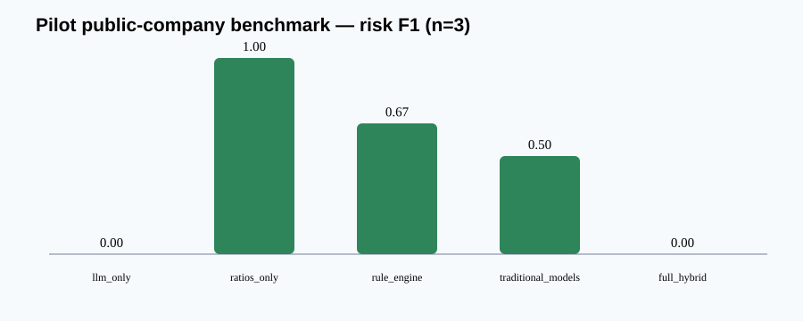

<div align="center">


# FinRisk

### Enterprise Financial Risk Intelligence & Management — Research Prototype

[](https://github.com/siqiwang0712-commits/financial-risk-agent/actions/workflows/ci.yml)
[](https://www.python.org/)
[](https://fastapi.tiangolo.com/)
[](https://nextjs.org/)
[](LICENSE)

**An evidence-grounded financial risk platform where an LLM plans and interprets, deterministic financial tools execute, and every material conclusion must trace back to verified evidence.**

[Quick start](#quick-start) · [Architecture](#architecture) · [Research results](#real-results-not-marketing-results) · [Workbench](#analyst-workbench) · [Documentation](#documentation)

</div>

> [!IMPORTANT]
> **Risk severity ≠ evidence coverage ≠ evidence quality ≠ model disagreement ≠ reliability ≠ probability.** FinRisk's 0–100 risk index is an expert-designed heuristic, not a bankruptcy probability, credit rating, fraud finding, or investment recommendation. Reliability is `UNCALIBRATED` unless a pinned held-out calibration run establishes otherwise.

## v0.3.2 — Reproducibility & Runtime Integrity (release hardening)

v0.3.2 is a prospective hardening release. It does not regenerate E1/E2/E3 or
reinterpret their results. It separates read-only frozen replay from new experiment
creation, records the actual Git commit and dirty state for future experiments, adds a
v2-compatible label schema and standalone-period FCF methodology, wires `DATABASE_URL`
to durable PostgreSQL repositories and credentials, derives risk cases from server-held
snapshots, and hardens authenticated analysis endpoints and deployment defaults.

```bash
python scripts/replay_frozen_experiment.py v0.3.1-E1-diagnostic
python scripts/replay_frozen_experiment.py v0.3.1-E2
python scripts/replay_frozen_experiment.py v0.3.1-E3
```

Frozen replay verifies existing manifest and artifact bytes and reports both the
original generation commit and current replay commit. It performs no writes. A replay
is not regeneration: current code is not used to recreate historical outputs.
The E1/E2/E3 manifests record original generation commit
`1486cf8e2e86115bff27f3f0c8940e2237efaf10`; this provenance is preserved even though
the working tree and released code have advanced.

The prospective provenance validator distinguishes direct SEC facts from deterministic
derivations and recursively requires every derivation parent to terminate in a valid SEC
source row. During final closeout this correctly rejected 24 legacy corpus observations
whose historical v1 `total_debt` derivation treated one missing component as zero. Those
frozen inputs and E3 outputs remain unchanged; they are not silently upgraded to v2
provenance semantics.

The current runtime uses PostgreSQL whenever `DATABASE_URL` is set; in-memory storage is
an explicit test/lightweight-development mode. Production mode rejects missing/default
database credentials and disables organization/snapshot bootstrap endpoints. See
[`docs/reproducibility_runtime_integrity.md`](docs/reproducibility_runtime_integrity.md)
for replay, persistence, trust-boundary and deployment maturity details.

## v0.3.1 — Decision Integrity & Research Readiness (released, frozen)

This local hardening release makes the existing architecture stricter without adding new product domains:

- non-compensatory, coverage-aware fusion prevents severe supported dimensions from being averaged away;
- missing dimensions remain unknown rather than entering fusion as zero;
- evidence IDs are de-duplicated before contributing and adverse-evidence monotonicity is regression-tested;
- narrative checks are claim-conditioned: target, direction, horizon, basis, qualifiers and required evidence constructs are validated before contradiction classification;
- API, Workbench and DecisionBundle expose calibration maturity and never present the evidence-quality index as a correctness probability;
- XBRL, rules, models, narrative, Critic, Verifier and fusion record observed component deltas for replay—a telemetry foundation, not a Value-of-Information estimator.

Machine-readable reason codes include `SEVERE_VERIFIED_SIGNAL`, `INSUFFICIENT_EVIDENCE`, `CLAIM_CONTEXT_INCOMPLETE`, `HIGH_MODEL_DISAGREEMENT`, `UNVALIDATED_RELIABILITY` and `CRITICAL_DIMENSION_ESCALATION`.

The independently written replay artifacts live under [`research/results/v0.3.1`](research/results/v0.3.1). The frozen `public_v1` directory is not overwritten. **v0.3.1 improves decision integrity and research readiness, but does not establish real-world predictive superiority.**

### Empirical Validation Foundation (local numeric run)

The pre-registered 30-company registry is expanded into a deterministic 30 × 3 plan with an 18/6/6 company-disjoint train/validation/frozen-test split. Sixteen official SEC 2021Q1–2024Q4 Financial Statement Data Set ZIPs produce all 90 filing-level feature observations. E3 separates future annual filings into a label-only outcome pool: outcome facts are admitted only after each observation cutoff and never enter features. The PIT gate passes with zero company overlap and zero detected future leakage. The frozen calendar-12-month endpoint yields 42 verified labels (34 negative, 8 positive), 6 review-required cases and 42 insufficient observations: 17 next annual filings are genuinely outside the fixed window and 25 are explicitly right-censored by the available archive horizon. Missing outcomes are never imputed.

The immutable E3 numeric experiment evaluated six labelled test observations from five held-out companies, with one positive endpoint. AUROC was 0.100 for B0, 0.200 for B1, 0.100 for B2 and 0.100 for B6. Every baseline missed the positive case at its frozen threshold (FNR 1.0). Of 1,000 company-clustered bootstrap replicates, 691 retained both classes and 309 were invalid; the CI is deliberately reported `CI_NOT_ESTIMABLE` because class/cluster power is inadequate. This is a negative, underpowered result—not evidence of predictive superiority or probability calibration. E1 and E2 remain immutable audit artifacts; E3 deterministic replay matches all six frozen result/prediction artifacts byte-for-byte.

The implementation nevertheless makes the eventual run auditable and fail-closed:

- `PointInTimeGuard` rejects evidence made public after an observation cutoff, including later restatements.
- Dataset integrity stops on company overlap, future leakage, duplicate filings, invalid hashes, schema errors or system-generated labels.
- Forward labels are frozen independently of FinRisk output: objective 12-month distress and a secondary rule-defined deterioration endpoint.
- Experiment manifests pin dataset/split/rules/models/fusion/prompt/labels/seed/git revision; incomplete inputs cannot create an immutable freeze.
- Statistical tooling includes ranking/classification metrics, selective coverage and company-clustered bootstrap deltas. Case-control samples are explicitly `RANKING_ONLY`, not population PD calibration.

After installing the package locally, the single validation gate is:

```bash
python scripts/prepare_empirical_foundation.py
python scripts/run_empirical_validation.py
```

The second command exits non-zero until the relevant corpus integrity gate passes. `--allow-not-available` is only for CI/status reporting; it never runs a benchmark. Readiness is capability-scoped: missing documents/LLM access cannot block numeric B0/B1/B2/B6 once numeric observations and forward labels exist.

SEC acquisition now has three explicit routes: official `companyfacts.zip` or Financial Statement Data Set ZIPs, a local/offline cache, and the rate-limited live API fallback. Raw bulk files are intentionally Git-ignored. To import official bulk data and run the numeric baselines:

```powershell
# Place companyfacts.zip OR quarterly SEC Financial Statement Data Set ZIPs here.
New-Item -ItemType Directory -Force data/sec-bulk
python scripts/import_sec_bulk.py
python scripts/replay_frozen_experiment.py v0.3.1-E3
```

`run_numeric_benchmarks.py` is reserved for prospective experiments and refuses to
regenerate frozen E3 from a different HEAD. The importer records ZIP/member SHA-256
provenance, preserves missing values, selects original 10-K filings rather than silently
substituting amendments, and generates only a versioned forward numerical endpoint.
Corpus acquisition via the live API remains separately explicit and requires an
SEC-compliant identifying user agent:

```bash
SEC_USER_AGENT="Researcher Name researcher@example.edu" python scripts/acquire_empirical_corpus.py
```

## Why FinRisk exists

Annual reports, 10-Ks and 20-Fs scatter material evidence across XBRL facts, statements, footnotes, MD&A, risk factors and auditor language. An analyst must reconcile periods, units and restatements; calculate metrics consistently; test management claims against the numbers; and preserve a defensible source trail.

An unconstrained LLM is the wrong financial-risk oracle. It may transpose columns, lose units, improvise arithmetic, accept optimistic narrative, or produce an unsupported conclusion. FinRisk instead treats the LLM as a **fallible semantic sensor** inside a controlled system:

| Responsibility | System owner | Invariant |
|---|---|---|
| Authoritative numbers and normalization | XBRL + deterministic code | Preserve unit, period, filing and restatement provenance |
| Ratios, trends, scenarios and model formulas | Deterministic tools | Independently reproducible and tested |
| MD&A, notes and audit-language interpretation | Schema-constrained LLM | Semantic extraction only; never final scoring |
| Risk patterns and thresholds | Versioned rules and policy | Inspectable, replayable and organization-scoped |
| Material conclusions | Failure-aware fusion + verification | No valid evidence path → `REVIEW` or `ABSTAIN` |

The core research proposition is simple:

> **Financial arithmetic belongs to deterministic systems. Semantic interpretation belongs to a constrained LLM. Decisions belong to an auditable evidence path.**

## What you can do

- Ingest SEC Company Facts / inline XBRL and page-aware annual-report PDFs.
- Normalize financial values across currency, scale, period, taxonomy and restatement candidates.
- Compute liquidity, leverage, profitability, cash-flow, working-capital and trend metrics.
- Run Altman Z, Beneish M, Piotroski F and Ohlson O with explicit applicability checks.
- Evaluate 68 versioned expert rules without scattering thresholds through application code.
- Extract structured narrative claims through mock or real OpenAI-compatible providers.
- Verify quotations against cited pages before admitting them as evidence.
- Compare narrative with multi-signal numeric evidence across six consistency domains.
- Fuse risk using weighted-average, max-severity, hierarchical or interaction-aware strategies.
- Convert findings into tenant-scoped risk cases, actions, reviews and immutable audit events.
- Replay an assessment from frozen inputs and versions, then show any output drift.
- Apply deterministic stress scenarios and compare baseline versus stressed decisions.
- Update `R(t-1) → R(t)` with traceable risk, metric and evidence-change attribution.
- Route traditional models through explicit `APPLICABLE / LIMITED / NOT_APPLICABLE` decisions.
- Gate automation on evidence coverage, calibrated reliability and disagreement.
- Preserve a complete immutable DecisionBundle and governed mitigation lifecycle.

## Architecture


The three layers enforce a strict dependency boundary:

1. **Interface Layer** — FastAPI and the Next.js Workbench present data, workflow and proof. They do not calculate financial risk.
2. **Agent Reasoning Layer** — the planner and orchestrator select typed tools, assess sufficiency, cross-check signals, verify claims, reflect, and synthesize or abstain.
3. **Tool / Code Layer** — ingestion, normalization, metrics, models, rules, evidence, contradiction detection, fusion and replay execute deterministically.

```text
User
  ↓
Interface ── Portfolio · Entity · Risk Case · Scenario · Governance · Audit
  ↓
Agent ───── Understand → Plan → Collect → Execute → Cross-check → Verify → Reflect
  ↓                                      ↓
Tools ───── XBRL/PDF · Metrics · Models · Rules · Evidence · Fusion · Replay
  ↓
Verified evidence graph → PASS / FLAG / REVIEW / ABSTAIN
```

Only structured execution metadata is retained: plan step, tool name, status, result summary, evidence references, rationale and confidence. Hidden chain-of-thought is neither stored nor displayed.

### Agent tool registry

The typed registry exposes:

| Tool family | Capabilities |
|---|---|
| Ingestion | PDF extraction, XBRL normalization, period and unit reconciliation |
| Financial | ratios, trends, period comparison, missing-data detection, scenarios |
| Models | Altman, Beneish, Piotroski, Ohlson, applicability checks |
| Rules | versioned single-factor and cross-factor risk signals |
| Evidence | retrieval, quote verification, provenance graph construction |
| Consistency | narrative–numeric support, tension and contradiction classification |
| Decision | signal calculation, policy resolution, fusion, snapshot and replay |
| Temporal | entity risk state, evidence delta, attribution and filing timeline |
| Governance | applicability, selective automation, critic/verifier and DecisionBundle |

Unknown tools, malformed arguments and missing required inputs fail closed.

## Evidence is the product


Every material conclusion follows this graph:

```text
document → page/section/span → extracted fact or claim → metric/rule/model
         → fusion contribution → risk dimension → final decision
```

A decision trace records reason code, document hash, accession, source page or XBRL concept, rule/model/prompt/fusion versions, confidence, coverage, disagreement and contribution. Evidence states remain explicit:

- `UNVERIFIED` — proposed but not confirmed at the cited location.
- `LOCATED` — extracted from a source location but not reconciled.
- `VERIFIED` — matched to the cited report evidence.
- `REJECTED` — verification failed; the claim cannot influence the result.

Conflicting top-ranked facts are not silently selected. Missing values are never replaced with zero. Broken paths trigger review or abstention.

### Deterministic replay

Each analysis can freeze its input hash, document version, policy and rule versions, prompt/model version, fusion strategy, configuration and timestamp into an immutable snapshot. Replay creates a separate result and diff; it never overwrites the historical decision.

This makes questions such as these answerable:

- Was the source document different?
- Did a threshold, model, prompt or fusion strategy change?
- Is the result byte-for-byte reproducible under the pinned configuration?
- Which decision path changed, and why?

See [Decision-grade controls](docs/decision_grade_controls.md).

### Risk is an evolving state

FinRisk now models a filing as an update from `R(t-1)` to `R(t)`, not an isolated score. `RiskDelta` separates dimension, metric and evidence changes and attaches each attribution driver to evidence-path identifiers. The temporal graph adds `SUPPORTS`, `CONTRADICTS`, `SUPERSEDES`, `DERIVED_FROM`, `CONFIRMS`, `WEAKENS` and `INVALIDATES` relationships.

This capability is code-complete and fixture-tested. The current public pilot has one period per company, so real multi-period attribution quality remains **NOT VALIDATED**.

## Analyst Workbench


The Workbench follows the analyst's path rather than a chat metaphor:

```text
Portfolio → Entity → Risk Case → Risk Drivers → Evidence
          → Scenario → Governance → Audit
```

It keeps severity, trajectory, evidence coverage, decision confidence and model disagreement visually separate. Risk findings can become owned cases with reviewer status, due dates, actions, comments and an audited human override.

> The screenshot is from the local prototype. It is not evidence of a hosted production deployment.

## Real results, not marketing results

The checked-in public pilot runs five baselines on **three company-disjoint FY2024 observations**: Apple, Microsoft and Intel. It is intentionally too small for inferential claims, but it is reproducible and preserves a valuable negative result.



| Baseline | Decision coverage | Risk F1 | Balanced accuracy |
|---|---:|---:|---:|
| LLM Only¹ | 3/3 | 0.000 | 0.500 |
| Ratios Only | 3/3 | **1.000** | **1.000** |
| Rule Engine | 3/3 | 0.667 | 0.750 |
| Traditional Models | 3/3 | 0.500 | 0.500 |
| Full Hybrid | 2/3 | 0.000 | 0.500 |

¹ The recorded pilot used the deterministic offline semantic provider. A paid LLM baseline was **NOT RUN** because no API credential was supplied.

Full Hybrid did **not** outperform Ratios Only. Its contradiction F1 was `0.667`; most bootstrap intervals span `[0, 1]`. The result supports only two claims: the evaluation pipeline executes end to end, and the current fusion design needs a larger independently labelled validation set. It does not establish superiority of any architecture.

Artifacts:

- [Interpretation and limitations](research/results.md)
- [Machine-readable summary](research/results/public_v1/summary.json)
- [Raw predictions](research/results/public_v1/predictions.csv)
- [Per-company score decomposition](research/results/public_v1/score_decomposition.csv)
- [Confusion matrices](research/results/public_v1/confusion_matrices.csv)
- [Ablations](research/results/public_v1/ablations.csv)
- [Robustness checks](research/results/public_v1/robustness.csv)
- [Error analysis](research/error_analysis.md)

### Research questions

- **RQ1 — Grounding:** Does hybrid reasoning reduce unsupported claims relative to semantic-only analysis?
- **RQ2 — Consistency:** Do cross-modal checks improve narrative–numeric contradiction detection?
- **RQ3 — Classification:** Does Full Hybrid improve company-level risk classification under company-disjoint evaluation?
- **RQ4 — Robustness:** How sensitive are decisions to narrative, rules, models, trends, missing evidence and perturbations?

Current evidence is diagnostic only: RQ3 is not supported by the pilot, RQ2 has one true positive and one false positive, and RQ1 still requires a real-provider run.

## Project maturity

| Status | What it means here |
|---|---|
| **VALIDATED — limited local scope** | Automated tests and ≥90% coverage gate; Ruff, TypeScript and production frontend build; deterministic finance fixtures; 90-observation SEC numeric ingestion and PIT integrity; corrected B0/B1/B2/B6 execution |
| **IMPLEMENTED, NOT EXTERNALLY VALIDATED** | XBRL/PDF reconciliation, temporal state/attribution, applicability routing, selective automation, constrained provider, critic/verifier, DecisionBundle, risk-case mitigation workflow, RBAC/API keys, PostgreSQL migrations and Workbench |
| **PLANNED / NOT RUN** | Independently dual-reviewed ~90 company-year benchmark, paid-LLM evaluation, calibrated risk model, production identity/object storage/worker/telemetry deployment |

FinRisk is a research and enterprise-architecture prototype. It does not claim production deployment, regulatory approval, SOC 2, ISO 27001, external model validation or real enterprise customers.

## Quick start

### Prerequisites

- Python 3.11–3.13
- Node.js 22+
- npm 10+
- Docker Desktop (optional)

### Backend

```bash
python -m venv .venv
```

Windows PowerShell:

```powershell
.venv\Scripts\Activate.ps1
python -m pip install -e ".[dev]"
uvicorn finrisk.api:app --reload
```

macOS/Linux:

```bash
source .venv/bin/activate
python -m pip install -e ".[dev]"
uvicorn finrisk.api:app --reload
```

API documentation is available at `http://localhost:8000/docs`; health is at `http://localhost:8000/health`.

### Frontend

```bash
cd frontend
npm ci
npm run dev
```

Open `http://localhost:3000`.

### Docker Compose

```bash
docker compose up --build
```

Docker runtime validation was not available in the recorded local environment. The compose configuration and PostgreSQL-backed CI path exist, but local Docker operation is **NOT VALIDATED**.

### Run the synthetic offline demo

```powershell
$env:PYTHONPATH="backend"
python scripts/run_demo.py
```

The included company fixture is explicitly `synthetic`. It validates mechanics, not real-world performance.

### Reproduce the public pilot

```powershell
$env:PYTHONPATH="backend"
python scripts/run_public_benchmark.py
```

This replays the pilot into `research/results/v0.3.1/public_pilot_replay`. The checked-in
`research/results/public_v1` directory is the immutable v0.3.0 snapshot; the runner refuses
to use it as an output directory.

Rebuilding SEC snapshots separately requires an identifying User-Agent:

```powershell
$env:SEC_USER_AGENT="FinRisk-Agent your-email@example.com"
python scripts/build_public_benchmark.py
```

The ingestion client includes cache, rate limiting, retry/backoff, accession provenance and content hashes. A previously recorded live Company Facts rebuild received HTTP 403; this is preserved as a real failure, not replaced with synthetic “live” data.

## API surface

| Endpoint | Purpose |
|---|---|
| `POST /api/v1/assess` | Assess normalized current/prior financial data and optional page text |
| `POST /api/v1/documents/analyze` | Validate and analyze a PDF upload |
| `POST /api/v1/xbrl/normalize` | Normalize SEC Company Facts with provenance |
| `/api/v1/enterprise/*` | Tenant-scoped entities, cases, scenarios, policies, governance and audit |

PDF uploads validate magic bytes and limits (50 MB, 500 pages), and parsing runs outside the async event loop. Internet-facing deployment still needs production identity, malware scanning, isolated workers and operational validation.

The default narrative provider is deterministic and offline. To enable the schema-constrained real provider, copy `.env.example`, set `FINRISK_LLM_PROVIDER=openai`, configure `OPENAI_API_KEY`, and pin model pricing if cost estimates are needed. Calls record prompt version, attempts, tokens, estimated cost, latency and schema status. Tests never require a live API.

## Financial reasoning

### Metrics and trends

Liquidity, leverage, debt service, profitability, cash flow, working capital and multi-period growth are calculated from normalized inputs. Where prior-year values exist, balance-based return and working-capital metrics use average balances; single-period proxies are labelled.

### Traditional models

| Model | Output | Guardrail |
|---|---|---|
| Altman Z | distress screening zone | public-manufacturer applicability checks |
| Beneish M | manipulation-risk screening signal | never presented as fraud proof |
| Piotroski F | nine-signal financial-strength score | original value-stock context disclosed |
| Ohlson O | O-score and separately derived logistic probability | input-domain and unit warnings |

Model mappings are configured in [config/model_scoring.json](config/model_scoring.json).

### Expert rules and policy

[rules/rules.json](rules/rules.json) contains 68 versioned rules covering single-factor and cross-factor patterns. Correlated rules carry family metadata so aggregation retains the strongest applicable family signal instead of blindly summing overlapping thresholds. Global baseline, sector and organization policy remain separable and versioned.

### Failure-aware decisions

Missing evidence, low coverage, conflicting evidence, stale data, parser failure, unavailable LLMs, applicability failures and rule/model disagreement are first-class states. Depending on pinned policy, they reduce evidence sufficiency, increase review requirements or force abstention—never fabricated certainty.

The incident-style [Failure Lab](failure_lab/README.md) maps each injected failure to its impact, expected fail-closed response and regression test.

## Verification

Run the same gates used locally:

```bash
pytest --cov=finrisk --cov-report=term-missing --cov-fail-under=90
ruff check backend tests scripts
```

```bash
cd frontend
npm run typecheck
npm run build
```

Recorded local closeout status: **143 tests passed** on both Python 3.11.9 and 3.12.10 with a real PostgreSQL 17 service, at **90.56% line coverage**. PostgreSQL migrations, restart persistence, Ruff, frontend semantic tests, TypeScript, the Next.js production build, prospective provenance validation and deterministic replay pass locally. The v0.3.2 implementation is on `main`; the final release-integrity changes are local and uncommitted, and no v0.3.2 tag or Release exists.

## Repository map

```text
financial-risk-agent/
├── backend/finrisk/       # domain, tools, agent, services and REST API
├── frontend/              # Next.js analyst Workbench
├── config/                # scoring, model and policy configuration
├── rules/                 # 68 versioned expert rules
├── tests/                 # unit, security, replay and integration tests
├── research/              # protocol, frozen pilot, ablations and errors
├── docs/                  # architecture, controls, threat model and assets
├── examples/              # explicitly synthetic fixtures and sample report
├── scripts/               # demo, benchmark and data-build entry points
├── portfolio/             # technical narrative and interview materials
├── docker-compose.yml
└── PROJECT_STATUS.md
```

## Security and governance

- Organization-scoped repositories and service checks enforce tenant boundaries.
- Enterprise API credentials are hashed server-side; caller-supplied role headers are not trusted.
- Human overrides retain original decision, new decision, actor, reason and timestamp.
- Model, prompt, rule, fusion and policy versions are recorded for formal runs.
- Credentials, `.env`, private reports, uploads, caches, generated assessments and local builds are ignored.

These are implemented controls in a prototype, not certification claims. Review the [threat model and readiness boundary](docs/decision_grade_controls.md) before any deployment.

## Limitations

- The public benchmark has only three company-year observations and single-reviewer labels.
- No paid-provider LLM benchmark has been run; mock/offline semantics are for testing and pipeline reproduction.
- PDF table reconstruction is conservative; complex geometry, OCR and cross-page headers need further work.
- Live SEC Company Facts retrieval was blocked by HTTP 403 in the recorded environment, although offline ingestion tests pass.
- The consistency engine covers six domains; breadth and contextual precision require independent annotation.
- Rules, weights, fusion thresholds and evidence-coverage confidence are not externally calibrated.
- Component telemetry records observed deltas and cost/latency metadata; it is not causal attribution or a Value-of-Information algorithm.
- Traditional financial models have population and sector limitations, especially for financial institutions.
- Evidence matching proves provenance, not the truth or completeness of corporate disclosure.
- PostgreSQL, Docker, identity, object storage, worker and telemetry configurations have not been validated in a production environment.

For a precise implemented/partial/not-implemented inventory, see [PROJECT_STATUS.md](PROJECT_STATUS.md).

## Documentation

| Topic | Document |
|---|---|
| Architecture and enterprise boundary | [Enterprise platform](docs/enterprise_platform.md) |
| Decision trace, replay, governance and threat model | [Decision-grade controls](docs/decision_grade_controls.md) |
| Three-layer migration | [Migration map](docs/three_layer_migration.md) |
| Dataset and label provenance | [Dataset card](research/dataset_card.md) |
| Evaluation design | [Evaluation protocol](research/evaluation_protocol.md) |
| Results and negative findings | [Results](research/results.md) |
| Error analysis | [Error analysis](research/error_analysis.md) |
| Research limitations | [Limitations](research/limitations.md) |
| Temporal risk design | [Temporal risk intelligence](docs/temporal_risk_intelligence.md) |
| Capability truth table | [Capability maturity matrix](docs/capability_maturity_matrix.md) |
| Flagship real-data walkthrough | [Case Study 001 — Intel FY2024](docs/case_study_001.md) |
| Human–AI study | [Study protocol](research/human_ai_study_protocol.md) |
| Risk Case lifecycle | [Enterprise workflow](docs/risk_case_workflow.md) |

## Contributing

Contributions are welcome. Financial formula changes require edge-case tests and a primary-source rationale. New rules require a stable ID, category, severity, explicit conditions, bounded effect and duplication review. Synthetic fixtures must be labelled `synthetic`.

Read [CONTRIBUTING.md](CONTRIBUTING.md) before opening a pull request.

## License

Released under the [MIT License](LICENSE).

---

<div align="center">

**Evidence first. Failure aware. Reproducible by design.**

<sub>FinRisk studies what financial AI should automate, what it must verify, and what must remain a human decision.</sub>

</div>
