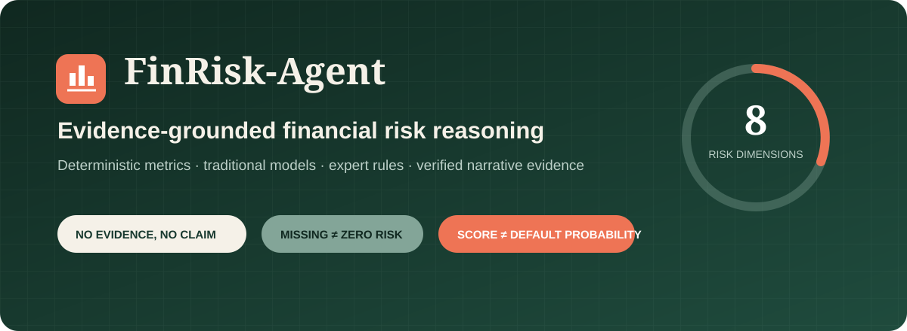
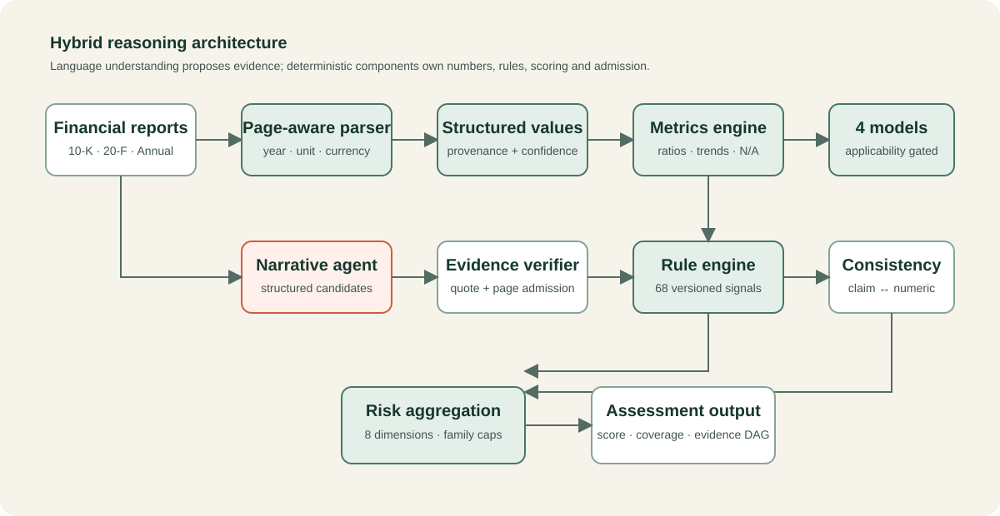
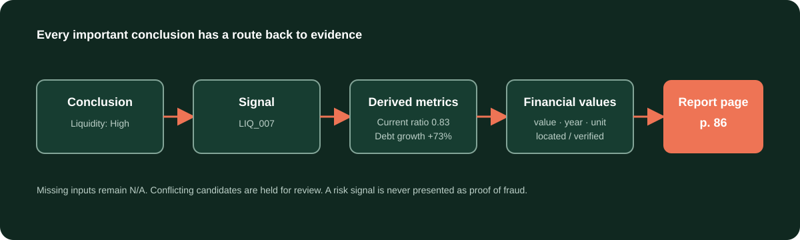

<div align="center">



# FinRisk-Agent

### An Evidence-Grounded Hybrid Agent for Explainable Corporate Financial Risk Assessment

[](https://github.com/siqiwang0712-commits/financial-risk-agent/actions/workflows/ci.yml)
[](https://www.python.org/)
[](https://fastapi.tiangolo.com/)
[](https://nextjs.org/)
[](#quality-and-testing)
[](#quality-and-testing)
[](LICENSE)

**Traceable risk signals from annual reports—not an LLM-generated opinion.**

[Quick start](#quick-start) · [Architecture](#architecture) · [Evidence model](#evidence-first-by-design) · [Research](#research-and-evaluation) · [Limitations](#limitations)

</div>

---

## Why FinRisk-Agent?

Annual reports, 10-Ks and 20-Fs distribute financial risk evidence across statements, footnotes, MD&A, risk factors and auditor language. A reader must reconcile numbers across years while deciding whether management's narrative agrees with the underlying indicators.

Using an LLM alone is not enough. It may transpose columns, lose units, calculate ratios inconsistently, accept optimistic language at face value or produce claims without a source page.

FinRisk-Agent treats an LLM as a **fallible semantic sensor**, not a financial-risk oracle. It assigns each task to the component that can perform it most auditably:

| Responsibility | Owner | Why |
|---|---|---|
| Parse and normalize financial values | Deterministic code | Units, signs and fiscal years must be reproducible |
| Calculate ratios, growth and model formulas | Deterministic code | Arithmetic should be independently testable |
| Detect financial risk patterns | Versioned expert rules | Thresholds and interactions must be inspectable |
| Interpret MD&A, notes and audit language | Structured narrative provider | Language understanding is the LLM's useful role |
| Admit textual evidence | Evidence verifier | A quote must exist on the cited page |
| Aggregate risk and coverage | Configured scoring engine | The LLM never chooses the final score |

> **Risk Score ≠ bankruptcy probability.** The 0–100 output is an expert-designed heuristic risk index. It is not a credit rating, fraud finding, investment recommendation or statistically calibrated probability of default.

## What the system produces

For a company and reporting period, the assessment contains:

- Overall risk score and level: Very Low, Low, Moderate, High or Critical
- A separate, uncalibrated evidence-coverage score with component breakdown
- Eight risk dimensions with key contributing signals
- Financial metrics, formulas, inputs and missing-data reasons
- Altman Z, Beneish M, Piotroski F and Ohlson O model breakdowns
- Triggered rule IDs, severity, rationale and page-level source references
- Narrative–numeric inconsistencies phrased as signals—not allegations
- Missing and conflicting information requiring review
- A typed evidence graph connecting source values to conclusions
- Text and PDF assessment output

### Eight risk dimensions

| Dimension | Typical questions |
|---|---|
| Liquidity | Can current resources cover near-term obligations? |
| Solvency & leverage | Is debt capacity or long-term balance-sheet resilience deteriorating? |
| Profitability | Are margins, ROA or ROE weakening? |
| Cash flow | Do operations and free cash flow support reported performance? |
| Earnings quality | Do profit, receivables, inventory and cash conversion agree? |
| Accounting | Are there screening signals that warrant additional review? |
| Governance & audit | Do audit opinions, controls or governance disclosures raise concern? |
| Business & going concern | Are refinancing, concentration, litigation or continuity risks present? |

## Architecture



The architecture deliberately separates deterministic and semantic reasoning. Financial arithmetic, model applicability, rule evaluation and score aggregation remain outside the LLM. Narrative candidates cannot affect a result until their quoted evidence is verified against the cited page.

### Processing pipeline

```text
Financial report
    ├── page-aware parsing ──→ structured financial values
    │                            ├── metrics and trends
    │                            ├── traditional risk models
    │                            └── versioned expert rules
    └── narrative extraction ─→ candidate claims ─→ evidence verifier
                                                     │
metrics + rules + models + verified claims ─────────┤
                                                     ↓
                                      consistency detection
                                                     ↓
                                       8 risk dimensions
                                                     ↓
                              risk score + evidence coverage
                                                     ↓
                                API · dashboard · PDF report
```

## Evidence-first by design



Every extracted value can preserve:

```text
value · unit · currency · fiscal year · statement · line item
document · page · original text · extraction confidence · restated status
```

Derived metrics retain their formulas and inputs. Rules and model mappings retain stable identifiers. The assessment exposes typed nodes and edges connecting financial values, metrics, models, signals, contradictions, dimensions and the overall result.

Evidence states are intentionally distinct:

- `unverified` — proposed but not located
- `located` — extracted directly from a report location but not reconciled
- `verified` — textual evidence matched to the cited page
- `rejected` — the proposed evidence could not be confirmed

Conflicting top-ranked financial candidates are excluded from scoring and returned as review issues. The system never silently replaces a missing value with zero.

## Financial reasoning engine

### Metrics

- Liquidity: current, quick and cash ratios; working capital
- Leverage: debt/equity, debt/assets, liabilities/assets and net debt
- Debt service: interest coverage and debt/EBITDA
- Profitability: gross, operating and net margins; ROA and ROE
- Cash flow: CFO/net income, free cash flow and FCF margin
- Working capital: receivable, inventory and payable days; cash conversion cycle
- Trends: revenue, earnings, CFO, FCF, debt, cash, receivables and inventory growth

Where prior-year data exists, balance-based return and working-capital metrics use average balances. Single-year calculations explicitly identify ending-balance proxies.

### Traditional models

| Model | Output | Guardrails |
|---|---|---|
| Altman Z-Score | Distress screening zone | Public-manufacturer applicability and domain checks |
| Beneish M-Score | Manipulation-risk screening signal | Never presented as proof of manipulation or fraud |
| Piotroski F-Score | Nine-signal financial-strength score | Original value-stock context disclosed |
| Ohlson O-Score | O-score plus separately derived logistic probability | Input-domain and index-unit warnings |

Model-to-risk mappings live in [`config/model_scoring.json`](config/model_scoring.json), including the metric, threshold, direction, dimension and score delta.

### Expert rule engine

The repository contains 68 versioned rules in [`rules/rules.json`](rules/rules.json). Rules cover both individual indicators and cross-metric interactions, for example:

```yaml
Revenue ↑ + Net income ↑ + Operating cash flow ↓
→ earnings-quality warning

Cash ↓ + Short-term debt ↑ + Current ratio below 1
→ liquidity and refinancing warning
```

Major correlated rule groups use explicit `family` metadata. Within a family, aggregation retains the strongest applicable signal instead of blindly summing overlapping thresholds. Cross-factor rules remain visible and auditable.

## Missing data and uncertainty

FinRisk-Agent follows two invariants:

```text
Missing data ≠ zero risk
Missing data = lower evidence coverage
```

If interest expense cannot be identified, interest coverage is reported as N/A with the missing input and impact. No value is guessed by the narrative provider.

The evidence-coverage score is separate from risk and currently combines:

1. Core financial data availability
2. Numeric provenance coverage
3. Verified narrative-claim coverage
4. Applicable traditional-model coverage
5. Multi-year temporal depth

This score is transparent but **not empirically calibrated**. Calibration is part of the planned real-data evaluation.

## Quick start

### Prerequisites

- Python 3.11–3.13 recommended
- Node.js 22+
- npm 10+
- Docker Desktop optional

### 1. Install the backend

```bash
python -m venv .venv
```

Windows:

```powershell
.venv\Scripts\Activate.ps1
python -m pip install -e ".[dev]"
```

macOS/Linux:

```bash
source .venv/bin/activate
python -m pip install -e ".[dev]"
```

### 2. Run the API

```bash
uvicorn finrisk.api:app --reload
```

- API: `http://localhost:8000`
- Interactive API docs: `http://localhost:8000/docs`
- Health check: `http://localhost:8000/health`

### 3. Run the dashboard

```bash
cd frontend
npm ci
npm run dev
```

Open `http://localhost:3000`, enter the company and fiscal year, select a PDF and run the local analysis.

### Docker Compose

```bash
docker compose up --build
```

The default narrative provider is deterministic and offline. No API key is required for development or automated tests.

## API overview

### Analyze normalized data

```http
POST /api/v1/assess
Content-Type: application/json
```

This endpoint accepts normalized current/prior financial dictionaries and optional page text. It is useful for deterministic tests and upstream structured-data integrations.

### Analyze a PDF

```http
POST /api/v1/documents/analyze
Content-Type: multipart/form-data
```

Fields:

- `company`
- `fiscal_year`
- `file`

The upload path validates PDF magic bytes, limits files to 50 MB and 500 pages, parses outside the async event loop, preserves prior-year candidates and always returns `review_required: true`. Production deployment still requires authentication, rate limiting and isolated workers.

## Example: offline synthetic demo

The repository includes one clearly labelled synthetic company fixture. It exists to validate system mechanics, not to demonstrate real-world performance.

```powershell
$env:PYTHONPATH="backend"
python scripts/run_demo.py
```

The demo exercises multi-year metrics, cross-factor rules, verified narrative evidence, a liquidity contradiction, missing model inputs and the final report structure.

## Research and evaluation

The project asks:

> Can combining deterministic financial reasoning, expert rules and evidence-grounded LLM analysis produce more reliable and explainable corporate risk assessments than using an LLM alone?

### Baselines

1. LLM Only
2. Ratios Only
3. Rule Engine Only
4. Traditional Financial Models
5. Full Hybrid FinRisk-Agent

Two executable ablations remove narrative evidence and temporal trends. Run the explicitly synthetic orchestration smoke test with:

```bash
python scripts/run_benchmark.py
```

The runner loads [`research/synthetic_manifest.json`](research/synthetic_manifest.json) and writes ignored JSONL artifacts. These results are **synthetic smoke outputs**, not empirical evidence.

The real benchmark protocol specifies company-disjoint splits, double annotation, adjudication, extraction accuracy, evidence precision, unsupported-claim rate, contradiction precision/recall/F1, valid-label classification metrics, calibration, bootstrap intervals, sector slices and error analysis.

Research documents:

- [`research/research_question.md`](research/research_question.md)
- [`research/methodology.md`](research/methodology.md)
- [`research/evaluation_protocol.md`](research/evaluation_protocol.md)
- [`research/ablation.md`](research/ablation.md)
- [`research/error_analysis.md`](research/error_analysis.md)
- [`research/limitations.md`](research/limitations.md)

## Quality and testing

Current local verification:

- 28 Python tests passing
- 93% line coverage
- Ruff static analysis passing
- TypeScript type checking passing
- Next.js production build passing
- PDF upload integration, evidence-state, multi-year extraction and scoring-family tests
- CI enforces a 90% backend coverage threshold

Run locally:

```bash
pytest --cov=finrisk --cov-report=term-missing --cov-fail-under=90
ruff check backend tests scripts
```

```bash
cd frontend
npm run typecheck
npm run build
```

GitHub Actions runs backend and frontend checks on pushes and pull requests.

## Repository structure

```text
financial-risk-agent/
├── backend/finrisk/       # domain, parser, metrics, models, rules, scoring, API
├── config/                # scoring weights and traditional-model mappings
├── frontend/              # Next.js dashboard
├── rules/                 # 68 versioned expert risk rules
├── tests/                 # unit, boundary and integration tests
├── research/              # question, method, manifests and evaluation protocol
├── docs/                  # architecture assets and independent audit responses
├── examples/              # explicitly synthetic fixtures
├── scripts/               # demo and benchmark entry points
├── portfolio/             # interview narrative and technical deep dive
├── docker-compose.yml
└── FINAL_PROJECT_STATUS.md
```

## Security and privacy

The repository ignores credentials, `.env`, private reports, uploads, generated assessments, caches, dependency folders and local build output. Do not commit confidential filings or API keys.

Before internet-facing deployment, add:

- Authentication and authorization
- Rate limits and upload quotas
- Malware scanning and isolated PDF workers
- Persistent job and audit logging
- Dependency locking and supply-chain scanning
- Data retention and deletion controls

See [`.env.example`](.env.example) and [`.gitignore`](.gitignore).

## Limitations

This repository is a rigorously tested research prototype, not a production credit-rating system.

- PDF table reconstruction remains conservative; complex geometry, cross-page headers and OCR need further work.
- XBRL reconciliation is not implemented.
- V1 is English-first and the contradiction detector remains a liquidity-focused prototype.
- Rule families and weights require further domain-expert validation.
- Traditional models have population and sector limitations, especially for financial institutions.
- Evidence matching establishes provenance, not the truth or completeness of a disclosure.
- Confidence is an uncalibrated evidence-coverage score.
- No licensed, adjudicated real-company benchmark has yet been completed.

The complete implementation status is maintained in [`FINAL_PROJECT_STATUS.md`](FINAL_PROJECT_STATUS.md).

## Roadmap

- [ ] XBRL-first extraction and PDF reconciliation
- [ ] Table geometry and OCR fallback with bounding-box provenance
- [ ] Eight-dimension structured narrative ontology
- [ ] Sector-specific applicability and rule packs
- [ ] Professional PDF report with internal evidence links
- [ ] Licensed, double-annotated benchmark corpus
- [ ] Empirical confidence calibration and rule sensitivity analysis
- [ ] Authenticated background-worker deployment

## Contributing

Contributions are welcome. Financial formula changes require edge-case tests and a primary-source rationale. New rules require a unique stable ID, category, severity, explicit conditions, bounded effect and non-duplication review. Synthetic fixtures must be labelled `synthetic`.

Read [`CONTRIBUTING.md`](CONTRIBUTING.md) before opening a pull request.

## Project audits

The repository keeps independent Agent review responses as engineering records:

- [`docs/optimization_review.md`](docs/optimization_review.md)
- [`docs/second_agent_review.md`](docs/second_agent_review.md)
- [`docs/third_agent_review.md`](docs/third_agent_review.md)

They document what was fixed, what remains partial and why the project avoids overstating maturity.

## License

Released under the [MIT License](LICENSE).

---

<div align="center">
<strong>FinRisk-Agent</strong><br/>
Deterministic where correctness matters. Semantic where language matters. Evidence-grounded everywhere.
</div>
