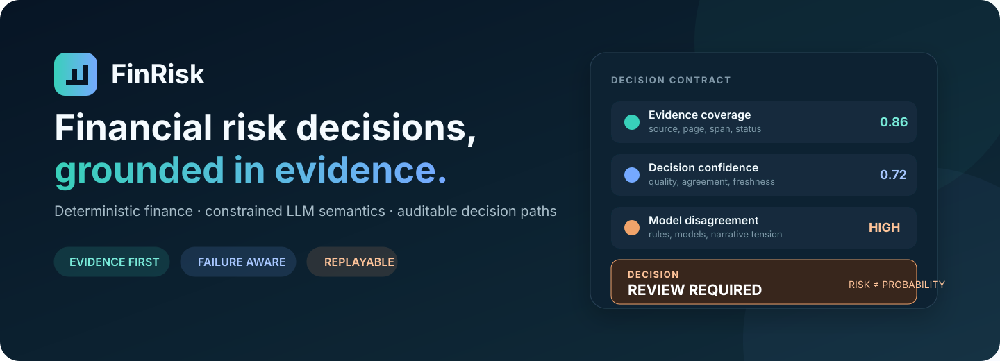
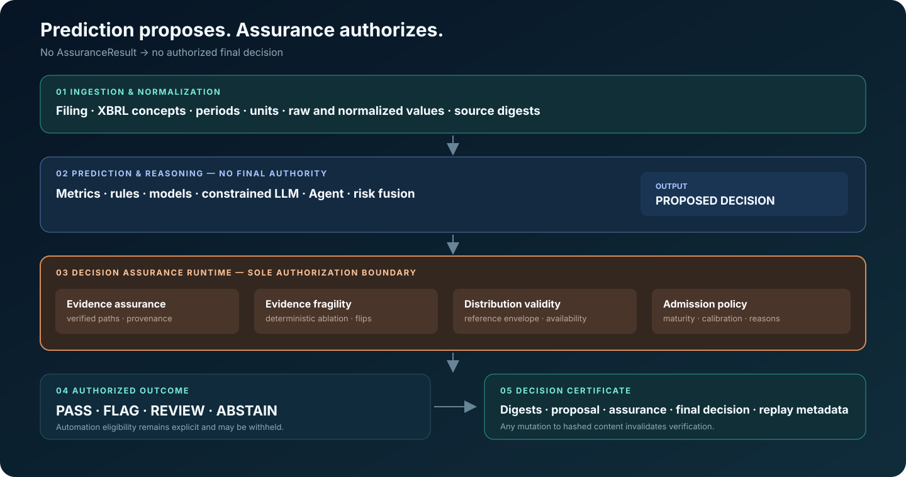

<div align="center">




# FinRisk

### Assured selective financial intelligence — v0.4.2

[](https://github.com/siqiwang0712-commits/financial-risk-agent/actions/workflows/ci.yml)
[](https://www.python.org/)
[](LICENSE)

**A research system that separates financial-risk prediction from decision authorization.**

English | [简体中文](README.zh-CN.md)

Current release metadata: **v0.4.2 — 2026-10-08** ·
[Release notes](RELEASE_NOTES_v0.4.2.md) · [Security and validation](docs/SECURITY_HARDENING_v0.4.2.md)

v0.4.2 is a security/reliability patch. Publication is a separate maintainer action;
v0.4.1 research evidence is preserved, FinRisk remains UNCALIBRATED, and E5 remains blocked/unfrozen.

[Quick start](#quick-start) · [How it works](#how-it-works) ·
[Research results](#research-results) · [Documentation](#documentation)

</div>

> [!IMPORTANT]
> **FinRisk is a research prototype.** v0.4 implements an Assurance Runtime, but that
> implementation is not external validation. Its 0–100 risk index is an expert-designed,
> `UNCALIBRATED` heuristic—not a bankruptcy probability, credit rating, fraud finding,
> or investment recommendation. No production deployment, external validation,
> regulatory approval, or production SLA is claimed.

## What is FinRisk?

FinRisk is an open research system for analyzing financial deterioration and deciding
whether a proposed conclusion is sufficiently supported to be issued. It combines
structured SEC/XBRL facts and annual-report PDFs with deterministic financial metrics,
traditional screening models, versioned expert rules, and a constrained LLM that
interprets narrative disclosures.

Models, rules, fusion and Agent reasoning may produce a `proposed_decision`. They cannot
authorize a final decision. The independent Assurance Runtime evaluates verified evidence,
single-evidence fragility, reference-distribution validity, disagreement, calibration
status and policy maturity. Only a valid, hash-bound `AssuranceResult` can produce
`final_decision` and a replayable Decision Certificate.

This is the v0.3.x → v0.4 shift: v0.3.x provided evidence-grounded financial-risk
analysis; v0.4 makes decision authorization a separate, fail-closed runtime layer.
Severity, evidence support, fragility, distribution validity, model disagreement and
calibration remain separate quantities rather than one persuasive confidence score.

### What v0.4.1 adds

v0.4.1 completes research-readiness and release hardening around that architecture:
a research-only StrongTabularReference-v1, approved historical development data,
explicit V/O/VO/CC observability diagnostics, an empirical development reference,
selective-evaluation tooling and stage-aware E5 preflight. Upload admission, numeric
evidence provenance, malformed Assurance rejection and certificate-bound display were
also hardened. The software release does not establish prospective or external validity;
E5 remains blocked and unfrozen.

## Why FinRisk?

Annual reports, 10-Ks and 20-Fs scatter material evidence across XBRL facts, financial
statements, footnotes, MD&A, risk factors and auditor language. A defensible assessment
must reconcile periods, units and restatements; calculate metrics consistently; test
management narrative against the numbers; and retain a source trail.

An unrestricted LLM is not a reliable financial-risk oracle. It can transpose columns,
lose units, improvise arithmetic, accept optimistic language, or state conclusions that
the filing does not support. FinRisk assigns each responsibility to the component best
suited to it:

| Responsibility | System owner |
|---|---|
| Authoritative values, units, periods and restatements | XBRL ingestion and deterministic normalization |
| Ratios, trends, scenarios and model formulas | Tested deterministic tools |
| MD&A, notes and audit-language interpretation | Schema-constrained LLM |
| Risk patterns and thresholds | Versioned rules and policy |
| Risk score, severity and proposed disposition | Rules, models, fusion and Agent reasoning |
| Final decision authorization | Assurance Runtime only |
| Immutable decision record | Decision Certificate |

> **Prediction components may propose a financial-risk decision. Only the Assurance
> layer may authorize the final decision.**

## How it works



```text
Financial filing
        ↓
Ingestion / normalization
        ↓
Metrics / rules / models / constrained LLM / Agent
        ↓
Risk fusion → PROPOSED DECISION
        ↓
Decision Assurance Runtime
  evidence · fragility · distribution validity · admission policy
        ↓
PASS / FLAG / REVIEW / ABSTAIN
        ↓
Decision Certificate
```

The runtime enforces four responsibility boundaries:

1. **Interface Layer** — FastAPI and the Next.js Workbench present inputs, workflow and
   proof; they do not calculate financial risk.
2. **Prediction Layer** — deterministic tools and constrained Agent reasoning calculate
   financial signals and propose a disposition; they have no final-decision authority.
3. **Assurance Layer** — evidence assurance, deterministic ablation, distribution-validity
   diagnostics and versioned admission policy authorize, restrict or refuse the proposal.
4. **Certificate Layer** — input/document digests, component versions, proposal, assurance,
   final decision and replay metadata are content-hashed into an immutable certificate.

`FinRiskPipeline` remains the shared calculation owner for API, Agent and tool registry.
`AssuranceEngine` is the sole authorization owner. The enforced invariant is:

```text
No valid AssuranceResult → no authorized final_decision
```

Material claims trace from source document, location, period, XBRL concept, unit and raw
value through normalization, metric, rule/model and fusion contribution into the proposal
and its assurance decision. These are computational dependencies, not causal claims.

Read the [v0.4 Assurance architecture](docs/assurance_architecture.md),
[full platform boundary](docs/enterprise_platform.md),
[three-layer migration map](docs/three_layer_migration.md), and
[decision-grade controls](docs/decision_grade_controls.md).

## Key capabilities

- SEC Company Facts and inline-XBRL normalization with filing, period, unit, taxonomy,
  accession and restatement provenance.
- Page-aware annual-report PDF analysis with bounded, killable processing.
- Cross-source reconciliation without silent averaging or missing-value substitution.
- Liquidity, leverage, profitability, cash-flow, working-capital and multi-period trends.
- Altman Z, Beneish M, Piotroski-style F and Ohlson O screening with applicability checks.
- 68 versioned expert rules, including inspectable single-factor and cross-factor signals.
- Typed Agent orchestration that proposes—but cannot authorize—risk dispositions.
- Quote verification, evidence-state tracking and source-to-decision provenance graphs.
- Deterministic evidence ablation with score impact, decision flips and affected claims.
- Exact or explicitly approximate Decision-Sufficient Evidence sets.
- Conservative distribution-validity states that fail closed outside known conditions.
- Separate financial-value and reporting-observability vectors; missingness cannot silently
  raise financial severity.
- Immutable Decision Certificates, deterministic replay and mutation-detecting hashes.
- Explicit `REVIEW` / `ABSTAIN` behavior for insufficient coverage, contradictions,
  model disagreement, unavailable components or invalid inputs.

The precise implemented/partial/not-implemented inventory is maintained in
[Project Status](PROJECT_STATUS.md) and the
[Capability Maturity Matrix](docs/capability_maturity_matrix.md).

## API at a glance

The backend exposes health/readiness routes, deterministic and Agent assessment routes,
PDF and XBRL analysis, plus tenant-scoped enterprise workflows for entities, risk cases,
policies, snapshots, temporal risk, scenarios, fusion and audit events. Authenticated
routes use `X-API-Key`; organization and role are resolved from the server-side hashed
credential rather than caller headers.

Assessment responses distinguish `risk_score`, `risk_severity`, `proposed_decision`,
`assurance`, `final_decision` and `decision_certificate`. Legacy `decision` fields are
documented proposal/final aliases rather than overloaded confidence measures. Failures
retain correlation IDs and fail closed around validation, rate limiting,
datastore access and document processing. See the [complete API reference](docs/API_REFERENCE.md)
for every endpoint, upload limit, error contract and bootstrap rule. With the backend
running, interactive OpenAPI documentation is available at `http://localhost:8000/docs`.

## Quick Start

Prerequisites for a source checkout: Python 3.11 or 3.12, Node.js 22+, npm 10+, and
optionally Docker Desktop.

### Docker

The shortest development path builds the stack locally:

```bash
docker compose up --build
```

Open the Workbench at `http://localhost:3000`; the API is at
`http://localhost:8000`.

For images published by the maintainer, use `docker-compose.release.yml` and pin the
digests from the publication run. The audited v0.4.1 container run was a non-publishing
dry-run, not evidence that v0.4.1 release tags already exist:

```bash
cp .env.release.example .env    # edit secrets and first-run bootstrap settings
docker compose -f docker-compose.release.yml pull
docker compose -f docker-compose.release.yml up -d
```

First-run administrator provisioning, PostgreSQL password lifecycle, secret files,
health behavior, TLS, image digest pinning and GitHub attestation verification are covered
in the [container release and deployment guide](docs/CONTAINER_RELEASE.md). Do not use the
release stack before reading its bootstrap sequence.

### Local development

Backend:

```bash
python -m venv .venv
source .venv/bin/activate          # Windows PowerShell: .venv\Scripts\Activate.ps1
python -m pip install -e ".[dev]"
uvicorn finrisk.api:app --reload
```

Frontend, in a second terminal:

```bash
cd frontend
npm ci
npm run dev
```

Liveness is at `http://localhost:8000/health/live`; readiness is at
`http://localhost:8000/health/ready`.

### Synthetic offline demo

```powershell
$env:PYTHONPATH="backend"
python scripts/run_demo.py
```

The included company fixture is explicitly `synthetic`. It validates mechanics, not
real-world performance. For research verification and SEC source-data acquisition, use
the [reproducibility guide](research/EXPERIMENT_REPRODUCIBILITY.md).

## Research results

### v0.4.1 retrospective development reference

v0.4.1 adds a reproducible research-only `StrongTabularReference-v1`. On the
**design-exposed**, selectively verified E4-S development subset (675 observations /
675 companies; 235 events and 440 non-events), the prespecified procedure mechanically selected `VO` + Histogram Gradient
Boosting. Its out-of-fold **retrospective-development** AUROC is **0.881789** and PR-AUC
is **0.828968**. These are not independent validation estimates. The score is
`UNCALIBRATED`, does not authorize decisions, and is not used by the production pipeline.

The corresponding observability diagnostic finds AUROC `0.872060` for values (`V`),
`0.835933` for observability only (`O`), `0.881789` for their explicit combination
(`VO`), and `0.676736` on the 154-row complete-case sensitivity subset (`CC`). CC contains
only 10 events, so its estimate is a small-subset sensitivity result and is not directly
comparable to the full-cohort estimates. Reporting availability therefore carries
retrospective predictive information here; it is not a causal finding or financial
severity. See the
[canonical results](research/strong_tabular_reference/artifacts/canonical_results.json),
[diagnostic report](research/strong_tabular_reference/OBSERVABILITY_DIAGNOSTIC.md), and
[v0.4.1 release notes](RELEASE_NOTES_v0.4.1.md).

All 2,000 E4-S source companies are mandatory future E5 exclusions. E5 remains
`BLOCKED / DRAFT_NOT_FROZEN`: no future cohort, prediction, outcome, or freeze identity exists.

The original E4 evidence comes from the locked v0.3.4 implementation and its explicitly
post-hoc audits. Its 674 verified outcomes are a different historical object from the
675-observation E4-S development subset above. Earlier pilot and v0.3.1 artifacts remain
available as historical audit records.

| E4 result | Value |
|---|---:|
| Frozen company-disjoint FY2024 cohort | 2,000 companies |
| Deterministically verified outcomes | 674 (235 events) |
| B0 ratios-only AUROC | 0.678 (95% CI 0.633–0.721) |
| B6 temporal-risk AUROC | 0.708 (95% CI 0.663–0.750) |
| Paired B6 − B0 ΔAUROC | +0.030 (95% CI +0.014 to +0.048) |

B6 improves over B0 on the deterministically verifiable E4 subset. The endpoint is
financial deterioration—not bankruptcy, default, credit loss or insolvency probability—and
verified coverage was 33.7% of the frozen cohort.

Later work narrows the interpretation:

- **E4-S statistical audit:** correctly specified paired tests support the same direction,
  but E4's published label-permutation p-value tests a different null than the equality
  claim attached to it. The audit re-execution is a ~94%-overlapping near-reproduction,
  not an independent sample.
- **E4-R robustness study:** on the 675-observation E4-S replication cohort, B6 reaches
  0.705 AUROC while the prespecified nonlinear tabular challenger reaches 0.885. Strong
  learned baselines outperform B6; a material share of their advantage reflects reporting
  and missingness structure, and the analysis remains post-hoc.
- **Agent and Hybrid results:** E4's fully paired comparison contained only five verified
  events, so incremental Agent/Hybrid value was not established. The post-hoc Codex
  comparator does not change that boundary.

All systems remain `UNCALIBRATED`. The research does not establish population-wide
performance, full-document Agent validity, calibrated probability, production fitness or
regulatory validity.

Start with the [Experiment Overview](research/EXPERIMENT_OVERVIEW.md) and
[Experiment Results](research/EXPERIMENT_RESULTS.md). Full methods and caveats are in the
[E4 validation report](research/e4/public/VALIDATION_REPORT.md),
[E4-S audit](research/e4_statistical_audit/AUDIT_REPORT.md),
[E4-R final report](research/e4r_automated_robustness/FINAL_REPORT.md), and
[research limitations](research/limitations.md).

<details>
<summary>Generated E4-S and E4-R audit detail</summary>

The concise snapshot above is the recommended first read. The block below remains tied to
the checked-in research artifacts so the repository's render-replay checks can detect
statistical drift.

### E4-S statistical audit

Status `POST_E4_STATISTICAL_AUDIT`. E4-S re-tests E4's primary inference under a correctly specified paired test and re-executes the frozen pipeline from public inputs. It modifies nothing under `research/e4/`: a SHA-256 manifest of every published E4 artifact, enforced in the test suite, proves it.

E4's per-observation rows were never published, so the audit re-ran the frozen v0.3.4 pipeline with an empty 270-CIK exclusion (a documented deviation) and publishes its own cohort, predictions and paired rows. That cohort is **675 observations / 235 events**, **~94% overlapping** with E4's 674 (47 of 50 sampled E4-B companies are present in the replication cohort): a near-reproduction, not an independent sample.

| Method | Null it actually tests | ΔAUROC | 95% interval | p |
|---|---|---:|---|---:|
| E4 frozen label permutation (2,000 replicates) | `H0_independence` | +0.0303 | — | 0.0005 (attainable floor) |
| paired DeLong (the prespecified target) | `H0_equality` | +0.0264 | [+0.0101, +0.0426] | 0.00144 |
| cluster BCa bootstrap (20,000 replicates) | `H0_equality` | +0.0264 | [+0.0111, +0.0438] | — |
| score-swap randomization (20,000 replicates) | `H0_exch` | +0.0264 | — | 0.00450 |

Verdict `CONSISTENT_SUPPORT`: every test that targets the equality hypothesis rejects in the same direction with the same point estimate. Two findings travel with it and must be reported together:

- **E4's published p-value is not a test of the hypothesis E4 states.** It shuffles labels while holding each `(B0, B6)` pair fixed, so its reference distribution is that of ΔAUROC under `H0_independence` — the outcome is independent of *both* scores. Rejecting it shows at least one score carries signal; it does not show B6 carries more than B0. The value is also exactly `1/2001`, the attainable floor at 2,000 permutations.
- **At E4's design point the procedure is nonetheless close to nominal.** Measured size 0.025 against a nominal 0.05 (0.025 for DeLong), and power 0.930 against DeLong's 0.935. E4's numbers are unaffected; only its justification changes. The simulation is Monte-Carlo with 200 replicates, so rates are resolved to roughly ±0.03.

Canonical detail: [E4-S audit report](research/e4_statistical_audit/AUDIT_REPORT.md), [method cross-check](research/e4_statistical_audit/inference_crosscheck.json) and the [replication packet](research/e4_statistical_audit/replication/README.md).

### E4-R automated robustness and competitive baselines

`research/e4r_automated_robustness/` is a **`POST_HOC_AUTOMATED_ROBUSTNESS`** retrospective study run on E4-S's published replication packet. It **does not modify E4**, **does not create confirmatory evidence**, **does not replace E5**, and evaluates robustness and competitive baselines only. Its configuration is frozen before the run and the pipeline aborts if the hash moves.

On the same 675 / 235 cohort, eleven nested-CV baselines (5×5 company-level stratified folds, preprocessing fitted inside the fold) and seven B6 ablations:

| Scorer | Out-of-fold AUROC | PR-AUC |
|---|---:|---:|
| B0 (frozen heuristic) | 0.679 | 0.541 |
| B6 (frozen heuristic) | 0.705 | 0.581 |
| Logistic, static only | 0.827 | 0.769 |
| Logistic, temporal only | 0.805 | 0.717 |
| Logistic, static + temporal (prespecified linear challenger) | 0.819 | 0.754 |
| Gradient boosting, temporal only | 0.863 | 0.776 |
| Gradient boosting, static + temporal (prespecified nonlinear challenger) | 0.885 | 0.839 |

P1 `B6 − B0` reproduces: ΔAUROC **+0.0264**, paired DeLong p = 0.00144, Holm-adjusted p = 0.00144, 20,000-replicate BCa **[+0.0109, +0.0434]**. P2 `logistic_F2 − B6` is **+0.1136** (Holm p = 1.2e-05) and P3 `hist_gb_F2 − B6` is **+0.1797** (Holm p = <1e-15 (underflow)).

Three pre-registered interpretation cases fire:

- **Case B** — B6's hand-designed aggregation is not competitive with a learned nonlinear tabular baseline.
- **Case D** — E4's gain depends materially on the temporal block. This is a *structural* result: `B6_no_temporal = 0.75 × B0` is a strictly increasing map of B0, so its AUROC equals B0's exactly and all B6 − B0 ranking separation is mechanically introduced through the temporal component. It is not a causal finding, and the gain is not concentrated in one term — removing `cash_growth` slightly *improves* AUROC.
- **Case F** — the aggregate improvement is not uniformly robust across the population, though only as a marker: `Transportation_Utilities`'s −0.005 point estimate has an interval containing zero.

A **post-hoc hardening pass** ([EXTENSION_PROTOCOL.md](research/e4r_automated_robustness/EXTENSION_PROTOCOL.md)) then closed four gaps a reviewer would be right to push on. It cannot upgrade any statement, and `experiment_config.json` was not touched.

- **A material share of the learned-model advantage is reporting structure.** Removing the imputer's missing-value indicators costs the logistic **−0.1599** AUROC (95% BCa [−0.2090, −0.1102]) and the boosting model **−0.0258** ([−0.0403, −0.0135]). A model given **only** the nine presence/absence flags — no financial value at all — reaches **0.835** (boosting) and **0.829** (logistic), i.e. above B6's 0.705. This is **not** called leakage: nothing shows an indicator carries outcome-side information, and the timestamp checks pass. Strict complete-case leaves 154 observations and 10 events and is reported as `NOT_ESTIMABLE` rather than estimated.
- **Temporal features add little once a strong static nonlinear learner is used.** `hist_gb_F0` (static only) reaches 0.880 against `hist_gb_F2`'s 0.885: Δ **+0.0056**, paired DeLong p = 0.39, BCa [−0.0069, +0.0187]. The superseded `F1 → F2` comparison could not answer this because `hist_gb_F0` did not exist.
- **The shuffled-temporal control is now genuinely paired** (one shared configuration; the original arm's folds asserted equal to the frozen run's). Shuffling costs the boosting model a median +0.0123 AUROC with 0 of 100 replicates reaching the original; the logistic moves +0.0013 with P(drop>0) = 0.605. The superseded 0.8741-versus-0.8851 discrepancy is explained as an inner-grid difference and retained as an audit note rather than deleted.
- **Sector heterogeneity is not established.** No gated sector has an interval-supported negative effect, and a 2,000-replicate permutation test does not reject a common effect (p = 0.25, I² = 0.10); the gated sectors cover 83.0% of the cohort.
- **Interval honesty.** The reported DeLong and bootstrap intervals condition on the realized out-of-fold predictions and do not integrate training-procedure uncertainty; repeated 5×5 nested CV measures that omitted component at sd ≈ 0.0039 (boosting) and 0.0059 (logistic), and it does not enter any primary comparison.

Reproduce with `python research/e4r_automated_robustness/verify_e4r.py`. Full protocol, artifacts and the generated report are in [the study directory](research/e4r_automated_robustness/README.md) and [FINAL_REPORT.md](research/e4r_automated_robustness/FINAL_REPORT.md).

### Robustness and data integrity

The canonical integrity, selection-bias and source-concordance results remain in the
[cross-study results](research/EXPERIMENT_RESULTS.md) and
[E4 post-completion audit](research/e4_posthoc/AUDIT_REPORT.md).

</details>

## Project maturity

**v0.4.1 — Research Readiness & Strong Reference** was released on **2026-10-05**.
The Assurance Runtime, proposal/authorization boundary, deterministic
fragility analysis, Decision-Sufficient Evidence, distribution-validity diagnostics and
Decision Certificate are implemented. This is a research-prototype software release:
it does not change frozen E4 results, establish prospective predictive superiority,
or freeze/run E5.

- **Validated in a limited research scope:** deterministic fixtures, automated quality
  gates, frozen E4 artifact integrity, and B6 over B0 on 674 verified E4 outcomes.
- **Internal development validation complete:** the Assurance authority boundary, evidence assurance,
  deterministic fragility, sufficient-evidence search, validity states, certificate hashing,
  replay integration, API contract, Workbench hierarchy, Python 3.11/3.12, installable
  artifacts, and Docker/PostgreSQL restart persistence.
- **Development reference only:** a hash-bound synthetic profile reproducibly exercises
  `IN_REFERENCE`, `WARNING` and `OUTSIDE_REFERENCE`. v0.4.1 also adds a label-independent
  `EMPIRICAL_DEVELOPMENT_REFERENCE_ONLY` research profile; neither is external validation,
  and unknown real-world inputs still fail closed.
- **Implemented, not externally validated:** XBRL/PDF reconciliation, temporal state,
  constrained provider, Agent critic/verifier, risk-case workflow, RBAC/API keys and storage.
- **Pending:** prospective E5, an E5-frozen reference-distribution design, calibrated
  admission policy, external validation and production/regulatory evaluation.

[Project Status](PROJECT_STATUS.md) is the authoritative maturity inventory. See the
[v0.4.1 release notes](RELEASE_NOTES_v0.4.1.md) and [Changelog](CHANGELOG.md) for release
scope and history. The [final engineering audit](docs/RELEASE_AUDIT_v0.4.1.md) records
the tested runtime SHA, successful CI and container dry-run, and local environment limits.

## Repository map

```text
backend/      core backend, deterministic tools, enterprise services and Agent
frontend/     Next.js analyst Workbench
config/       scoring, model and policy configuration
docs/         architecture, deployment, API, controls and workflow documentation
research/     protocols, frozen artifacts, validation, audits and limitations
rules/        68 versioned expert rules and explicit disabled-rule registry
tests/        unit, security, replay and integration tests
scripts/      demo, verification, benchmark and data-build utilities
examples/     explicitly synthetic fixtures and sample reports
failure_lab/  injected-failure catalogue and expected fail-closed behavior
```

## Security and governance

- Organization-scoped repositories and service checks enforce tenant boundaries.
- Enterprise API credentials are hashed server-side; caller-supplied role headers are not
  trusted.
- Human overrides preserve the original decision, replacement, actor, reason and time.
- Formal runs record model, prompt, rule, fusion and policy versions.
- Accepted or resolved risk cases require a verified server-side evidence path.
- Credentials, `.env` files, private reports, uploads, caches and generated assessments
  are excluded from version control.

These are implemented prototype controls, not certification claims. Review the full
[threat model and readiness boundary](docs/decision_grade_controls.md),
[enterprise platform boundary](docs/enterprise_platform.md), and
[reproducibility/runtime integrity guide](docs/reproducibility_runtime_integrity.md)
before any deployment.

## Documentation

### Understand FinRisk

- [v0.4 Assurance architecture](docs/assurance_architecture.md)
- [Architecture and enterprise boundary](docs/enterprise_platform.md)
- [Project Status](PROJECT_STATUS.md)
- [Decision-grade controls, governance and threat model](docs/decision_grade_controls.md)
- [Three-layer migration map](docs/three_layer_migration.md)
- [Capability Maturity Matrix](docs/capability_maturity_matrix.md)
- [Intel FY2024 evidence-linked case study](docs/case_study_001.md)

### Run FinRisk

- [Container release and deployment](docs/CONTAINER_RELEASE.md)
- [Reproducibility and runtime integrity](docs/reproducibility_runtime_integrity.md)
- [Experiment reproducibility](research/EXPERIMENT_REPRODUCIBILITY.md)
- [v0.4 internal development validation](research/v040_development/VALIDATION_REPORT.md)
- [Risk Case workflow](docs/risk_case_workflow.md)
- [Temporal risk intelligence](docs/temporal_risk_intelligence.md)

### Research

- [Experiment Overview](research/EXPERIMENT_OVERVIEW.md)
- [Experiment Results](research/EXPERIMENT_RESULTS.md)
- [Evaluation protocol](research/evaluation_protocol.md)
- [Error analysis](research/error_analysis.md)
- [Limitations](research/limitations.md)
- [E4-S statistical audit](research/e4_statistical_audit/AUDIT_REPORT.md)
- [E4-R robustness study](research/e4r_automated_robustness/FINAL_REPORT.md)
- [Human–AI study protocol](research/human_ai_study_protocol.md)
- [E5 draft — prospective validation of assured selective decisions](research/e5/README.md)

### Development

- [API Reference](docs/API_REFERENCE.md)
- [Contributing](CONTRIBUTING.md)
- [Changelog](CHANGELOG.md)
- [v0.4.1 release notes](RELEASE_NOTES_v0.4.1.md)
- [v0.4.1 final engineering audit](docs/RELEASE_AUDIT_v0.4.1.md)
- [v0.4.0 release notes](RELEASE_NOTES_v0.4.0.md)
- [v0.3.4 release notes](RELEASE_NOTES_v0.3.4.md)
- [Failure Lab](failure_lab/README.md)

## Limitations

FinRisk is a research prototype. In particular, it is:

- `UNCALIBRATED` and not a probability of bankruptcy, default or correctness;
- governed by a heuristic Assurance policy, not a calibrated selective-risk guarantee;
- unable to assert externally validated distribution validity; the bundled synthetic
  profile is `DEVELOPMENT_REFERENCE_ONLY` and the historical empirical research profile
  is `EMPIRICAL_DEVELOPMENT_REFERENCE_ONLY`, not an E5-frozen or production reference;
- not a credit rating, fraud finding or investment recommendation;
- not evidence of general population performance beyond the verified study subsets;
- not a validated replacement for human review of material financial decisions;
- not externally validated for production, regulatory or safety-critical use.

Risk severity, evidence coverage, evidence quality, model disagreement, reliability and
probability are different quantities. FinRisk does not collapse them into one another.
Rules, weights, fusion thresholds and evidence-coverage confidence are not externally
calibrated, and full-document Agent validation has not been run.

Read the complete [research limitations](research/limitations.md) for selection,
right-censoring, missingness, machine-review, model-population and reproducibility
boundaries.

## Contributing

Contributions are welcome. Financial formula changes require edge-case tests and a
primary-source rationale. New rules require a stable ID, category, severity, explicit
conditions, bounded effect and duplication review. Synthetic fixtures must be labeled
`synthetic`.

Read [Contributing](CONTRIBUTING.md) for the full rules and verification commands.

## License

Released under the [Apache License 2.0](LICENSE).

---

<div align="center">

**Prediction proposes. Assurance authorizes. Evidence remains inspectable.**

<sub>FinRisk studies what financial AI should automate, what it must verify, and what must remain a human decision.</sub>

</div>
