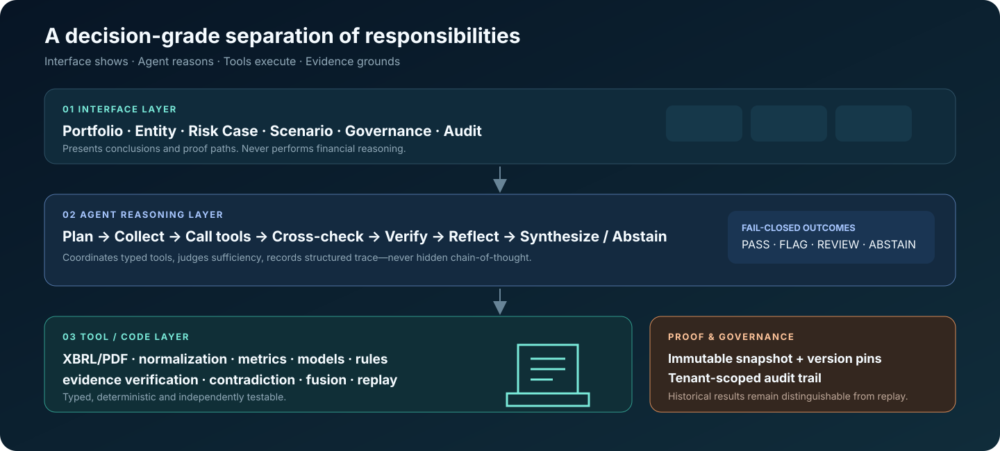

<div align="center">


# FinRisk

### 以证据为基础的金融风险智能——研究原型

[](https://github.com/siqiwang0712-commits/financial-risk-agent/actions/workflows/ci.yml)
[](https://www.python.org/)
[](LICENSE)

**以确定性金融分析为基础，由受约束的大语言模型负责语义解释、Agent 负责编排，
并要求每项重要结论都能沿证据链审计。**

[English](README.md) | 简体中文

[快速开始](#快速开始) · [工作原理](#工作原理) ·
[研究概览](#研究概览) · [文档导航](#文档导航)

</div>

> [!IMPORTANT]
> **FinRisk 是研究原型。** 其 0–100 风险指数是专家设计且尚未校准
>（`UNCALIBRATED`）的启发式指标，不是破产概率、信用评级、舞弊认定或投资建议。
> 本项目不声称已完成生产部署、外部验证、监管批准，也不承诺生产 SLA。

## 什么是 FinRisk？

FinRisk 是一个开放的金融风险研究平台，用于分析财务恶化信号及其背后的证据。
它把结构化 SEC/XBRL 数据和年报 PDF，与确定性财务指标、传统筛查模型、版本化专家规则，
以及用于解读叙述性披露的受约束大语言模型结合起来。

Agent 负责规划与协调分析，但不充当财务事实来源。算术由经过测试的代码完成；抽取出的
陈述必须通过证据核验。缺失、冲突、陈旧、不适用或无法核验的信息都会被明确保留，并可
触发 `REVIEW` 或 `ABSTAIN`，而不是生成虚假的确定性。

FinRisk 面向可审查的决策支持：风险严重度、变化趋势、证据覆盖率、决策置信度、模型分歧、
校准状态和来源信息彼此分开，不会被压缩成一个看似有说服力的总分。

## 为什么需要 FinRisk？

年报、10-K 和 20-F 的关键证据分散在 XBRL 事实、财务报表、附注、管理层讨论与分析
（MD&A）、风险因素和审计措辞中。可信的评估需要统一期间、单位和重述口径，稳定计算指标，
用数据检验管理层叙述，并保留可追溯的来源链。

不受约束的大语言模型并不适合充当金融风险裁判。它可能抄错列、丢失单位、自行编造计算、
轻信乐观叙述，或给出证据不足的结论。FinRisk 将职责交给更适合的系统组件：

| 职责 | 负责组件 |
|---|---|
| 权威数值、单位、期间和重述 | XBRL 摄取与确定性标准化 |
| 比率、趋势、情景和模型公式 | 经过测试的确定性工具 |
| MD&A、附注和审计措辞的解释 | 受 JSON Schema 约束的大语言模型 |
| 风险模式与阈值 | 版本化规则与策略 |
| 重要结论 | 故障感知融合与证据核验 |

> **金融计算属于确定性系统；语义解释属于受约束的大语言模型；决策属于可审计的证据链。**

## 工作原理



```text
财务报告
    ↓
摄取与标准化
    ↓
指标 / 模型 / 规则
    ↓
Agent 推理与交叉核验
    ↓
证据验证
    ↓
PASS / FLAG / REVIEW / ABSTAIN
```

三层结构形成明确的依赖边界：

1. **接口层（Interface Layer）**——FastAPI 与 Next.js Workbench 负责展示输入、流程和证据，
   不执行金融风险计算。
2. **Agent 推理层（Agent Reasoning Layer）**——规划器与编排器选择类型化工具，判断证据是否
   充分，交叉核验信号，验证结论，进行反思，并综合输出或弃权。
3. **工具/代码层（Tool / Code Layer）**——以确定性方式执行摄取、标准化、指标、模型、规则、
   证据、矛盾检测、融合和重放。

`FinRiskPipeline` 是 API、Agent 与工具注册表共享的运行时所有者。Agent 负责调度它，但不会
取代确定性的计算和决策路径。重要结论可以从文档位置或 XBRL 概念，追溯到相应工具、规则、
模型及其融合贡献，直至最终决策。

详见[完整架构与平台边界](docs/enterprise_platform.md)、
[三层迁移图](docs/three_layer_migration.md)和
[决策级控制](docs/decision_grade_controls.md)。

## 核心能力

- 摄取 SEC Company Facts 和 inline XBRL，并保留申报文件、期间、单位、分类体系、accession
  与重述来源。
- 对年报 PDF 进行页级分析，并通过有界、可终止的进程执行昂贵任务。
- 进行跨来源核对，不静默取平均，也不把缺失值替换为零。
- 计算流动性、杠杆、盈利、现金流、营运资金和多期趋势。
- 运行 Altman Z、Beneish M、Piotroski-style F 与 Ohlson O，并执行适用性检查。
- 评估 68 条版本化专家规则，包括可检查的单因素和交叉因素信号。
- 通过类型化 Agent 完成规划、工具调用、交叉核验、验证和故障感知综合。
- 验证引文、跟踪证据状态，并构建从来源到决策的来源图。
- 保存不可变快照，执行确定性重放和漂移比较，且不覆盖历史决策。
- 在覆盖不足、证据矛盾、模型分歧、组件不可用或输入无效时明确进入
  `REVIEW` / `ABSTAIN`。

准确的“已实现 / 部分实现 / 未实现”清单维护在
[项目状态](PROJECT_STATUS.md)与[能力成熟度矩阵](docs/capability_maturity_matrix.md)中。

## API 概览

后端提供健康/就绪检查、确定性与 Agent 评估、PDF 与 XBRL 分析，以及按租户隔离的实体、
风险案例、策略、快照、时序风险、情景、融合和审计事件接口。受保护的接口使用
`X-API-Key`；组织和角色由服务端保存的哈希凭据解析，不信任调用方自报的角色头。

验证、限流、数据存储和文档处理均采用失败关闭策略，错误会保留关联 ID。全部端点、上传限制、
错误契约和首次引导规则见[完整 API 参考](docs/API_REFERENCE.md)。后端运行后，可在
`http://localhost:8000/docs` 查看交互式 OpenAPI 文档。

## 快速开始

源码运行前提：Python 3.11 或 3.12、Node.js 22+、npm 10+；Docker Desktop 可选。

### Docker

最短的开发启动方式会在本机构建整个栈：

```bash
docker compose up --build
```

Workbench 位于 `http://localhost:3000`，API 位于 `http://localhost:8000`。

也可通过 `docker-compose.release.yml` 使用已发布的 GHCR 镜像：

```bash
cp .env.release.example .env    # 编辑密钥和首次引导设置
docker compose -f docker-compose.release.yml pull
docker compose -f docker-compose.release.yml up -d
```

首次管理员创建、PostgreSQL 密码生命周期、secret 文件、健康检查、TLS、镜像摘要固定和 GitHub
attestation 验证均在[容器发布与部署指南](docs/CONTAINER_RELEASE.md)中说明。使用发布栈前，
务必先阅读首次引导顺序。

### 本地开发

后端：

```bash
python -m venv .venv
source .venv/bin/activate          # Windows PowerShell: .venv\Scripts\Activate.ps1
python -m pip install -e ".[dev]"
uvicorn finrisk.api:app --reload
```

在另一个终端启动前端：

```bash
cd frontend
npm ci
npm run dev
```

存活检查位于 `http://localhost:8000/health/live`，就绪检查位于
`http://localhost:8000/health/ready`。

### 离线合成演示

```powershell
$env:PYTHONPATH="backend"
python scripts/run_demo.py
```

附带的公司样本被明确标记为 `synthetic`。它只验证运行机制，不代表真实世界表现。研究核验与
SEC 源数据获取见[可复现性指南](research/EXPERIMENT_REPRODUCIBILITY.md)。

## 研究概览

当前证据面以锁定的 v0.3.4/E4 研究及其明确标注为事后分析的审计为主。更早的 pilot 和
v0.3.1 产物仍保留为历史审计记录，但不再作为主要结果面。

| E4 结果 | 数值 |
|---|---:|
| 冻结且公司互斥的 FY2024 队列 | 2,000 家公司 |
| 可由确定性规则核验的结果 | 674（其中 235 个事件） |
| B0 仅比率基线 AUROC | 0.678（95% CI 0.633–0.721） |
| B6 时序风险 AUROC | 0.708（95% CI 0.663–0.750） |
| 配对 B6 − B0 ΔAUROC | +0.030（95% CI +0.014 至 +0.048） |

在 E4 可确定性核验的子集上，B6 优于 B0。终点是财务恶化，而非破产、违约、信用损失或
资不抵债概率；可核验结果仅覆盖冻结队列的 33.7%。

后续研究进一步收紧了结论边界：

- **E4-S 统计审计：** 正确设定的配对检验支持相同方向，但 E4 已发表的标签置换 p 值检验的
  原假设，与其文字所述的“两个模型相等”并不一致。审计重跑队列与 E4 约有 94% 重叠，属于
  近似复现，不是独立样本。
- **E4-R 稳健性研究：** 在 E4-S 的 675 条复现队列上，B6 AUROC 为 0.705，预先指定的非线性
  表格模型挑战者为 0.885。强学习基线明显优于 B6；其中相当一部分优势来自报告与缺失模式，
  且该分析仍属于事后研究。
- **Agent 与 Hybrid 结果：** E4 的完全配对比较只有 5 个可核验事件，因此尚未证明 Agent 或
  Hybrid 的增量价值。事后的 Codex 比较器不会改变这一边界。

所有系统仍为 `UNCALIBRATED`。现有研究没有证明总体人群表现、全文档 Agent 有效性、概率校准、
生产适用性或监管有效性。

建议从[实验总览](research/EXPERIMENT_OVERVIEW.md)和
[实验结果](research/EXPERIMENT_RESULTS.md)开始。完整方法与限制见
[E4 验证报告](research/e4/public/VALIDATION_REPORT.md)、
[E4-S 审计](research/e4_statistical_audit/AUDIT_REPORT.md)、
[E4-R 最终报告](research/e4r_automated_robustness/FINAL_REPORT.md)和
[研究限制](research/limitations.md)。

## 项目状态与成熟度

当前发布目标是 **v0.3.4 — Hardened Boundaries & Verified Release Runtime**。该版本让 API、
Agent 和工具注册表共用同一条配置好的 pipeline；把文档分析放入可终止进程边界；收紧外部输入
失败行为；并在发布前核验精确的容器摘要。它没有改变预测模型、校准状态或冻结的 E4 结论。

- **在有限研究范围内已验证：** 确定性样例、自动质量门槛、冻结 E4 产物完整性，以及 B6 相对
  B0 在 674 个可核验 E4 结果上的改进。
- **已实现但未外部验证：** XBRL/PDF 核对、时序状态、受约束 provider、Agent critic/verifier、
  重放、风险案例流程、RBAC/API key、PostgreSQL 迁移和 Workbench。
- **计划中或尚未运行：** 经人工裁定的文档基准、前瞻冻结的强模型比较、校准风险模型，以及在
  外部环境运行的生产身份、存储、worker 和 telemetry 基础设施。

[项目状态](PROJECT_STATUS.md)是成熟度的权威清单。发布范围与历史见
[v0.3.4 发布说明](RELEASE_NOTES_v0.3.4.md)和[变更日志](CHANGELOG.md)。

## 仓库结构

```text
backend/      核心后端、确定性工具、企业服务和 Agent
frontend/     Next.js 分析师 Workbench
config/       评分、模型和策略配置
docs/         架构、部署、API、控制与工作流文档
research/     协议、冻结产物、验证、审计和限制
rules/        68 条版本化专家规则与明确的禁用规则登记表
tests/        单元、安全、重放和集成测试
scripts/      演示、核验、基准与数据构建工具
examples/     明确标记为合成的样例和示例报告
failure_lab/  注入故障目录及预期的失败关闭行为
```

## 安全与治理

- 组织范围的 repository 查询和服务检查用于执行租户边界。
- 企业 API 凭据在服务端以哈希形式保存；不信任调用方提供的角色头。
- 人工 override 会保留原决策、新决策、执行人、原因和时间。
- 正式运行会记录模型、prompt、规则、融合和策略版本。
- 风险案例进入 Accepted 或 Resolved 前，必须具有服务端核验过的证据路径。
- 凭据、`.env` 文件、私有报告、上传文件、缓存和生成的评估不会进入版本控制。

这些是研究原型中的已实现控制，不是认证声明。部署前请阅读完整的
[威胁模型与就绪边界](docs/decision_grade_controls.md)、
[企业平台边界](docs/enterprise_platform.md)和
[可复现性与运行时完整性指南](docs/reproducibility_runtime_integrity.md)。

## 文档导航

### 理解 FinRisk

- [架构与企业边界](docs/enterprise_platform.md)
- [项目状态](PROJECT_STATUS.md)
- [决策级控制、治理与威胁模型](docs/decision_grade_controls.md)
- [三层迁移图](docs/three_layer_migration.md)
- [能力成熟度矩阵](docs/capability_maturity_matrix.md)
- [Intel FY2024 证据链案例](docs/case_study_001.md)

### 运行 FinRisk

- [容器发布与部署](docs/CONTAINER_RELEASE.md)
- [可复现性与运行时完整性](docs/reproducibility_runtime_integrity.md)
- [实验复现](research/EXPERIMENT_REPRODUCIBILITY.md)
- [风险案例工作流](docs/risk_case_workflow.md)
- [时序风险智能](docs/temporal_risk_intelligence.md)

### 研究

- [实验总览](research/EXPERIMENT_OVERVIEW.md)
- [实验结果](research/EXPERIMENT_RESULTS.md)
- [评估协议](research/evaluation_protocol.md)
- [错误分析](research/error_analysis.md)
- [限制](research/limitations.md)
- [E4-S 统计审计](research/e4_statistical_audit/AUDIT_REPORT.md)
- [E4-R 稳健性研究](research/e4r_automated_robustness/FINAL_REPORT.md)
- [人机协作研究协议](research/human_ai_study_protocol.md)

### 开发

- [API 参考](docs/API_REFERENCE.md)
- [贡献指南](CONTRIBUTING.md)
- [变更日志](CHANGELOG.md)
- [v0.3.4 发布说明](RELEASE_NOTES_v0.3.4.md)
- [Failure Lab](failure_lab/README.md)

## 限制

FinRisk 是研究原型。它：

- 尚未校准（`UNCALIBRATED`），不是破产、违约或判断正确性的概率；
- 不是信用评级、舞弊认定或投资建议；
- 不能证明可核验研究子集之外的总体人群表现；
- 不是对重大金融决策进行人工复核的已验证替代品；
- 尚未针对生产、监管或安全关键用途完成外部验证。

风险严重度、证据覆盖率、证据质量、模型分歧、可靠性和概率是不同概念，FinRisk 不会把它们
混为一谈。规则、权重、融合阈值和证据覆盖置信度没有经过外部校准，全文档 Agent 验证也尚未
完成。

选择偏差、右删失、缺失模式、机器复核、模型适用人群和可复现性边界见完整的
[研究限制](research/limitations.md)。

## 参与贡献

欢迎贡献。修改财务公式时，需要补充边界条件测试和一手资料依据。新增规则必须具有稳定 ID、
类别、严重度、明确条件、有界影响，并完成重复性检查。合成样例必须标记为 `synthetic`。

完整规范和核验命令见[贡献指南](CONTRIBUTING.md)。

## 许可证

项目采用 [MIT License](LICENSE)。

---

<div align="center">

**证据优先。识别失败。设计可复现。**

<sub>FinRisk 研究金融 AI 应当自动化什么、必须验证什么，以及哪些决策必须由人作出。</sub>

</div>
