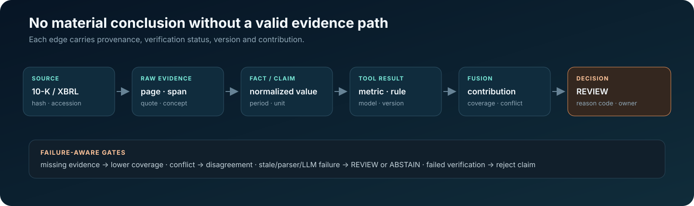

# Decision-grade Controls and Readiness

Status: **IMPLEMENTED BUT NOT EXTERNALLY VALIDATED**, except where explicitly marked.

## Reproducibility and audit

Each Agent result includes a decision trace, AssuranceResult, Decision Certificate and
immutable analysis snapshot containing canonical input/output hashes, document hashes,
rule/scoring/assurance-policy hashes, provider/prompt identity, fusion version and frozen
input/output. Replay comparison preserves the historical output and separately reports
`IDENTICAL` or `DRIFT_DETECTED`; it never overwrites history. PostgreSQL stores snapshots
and certificates. Risk cases cannot enter Accepted or Resolved without a verified path.

Every decision also carries machine-readable reason codes. v0.4 Assurance codes include
`INSUFFICIENT_VERIFIED_EVIDENCE`, `EVIDENCE_FRAGILITY_HIGH`,
`OUTSIDE_VALIDATED_DISTRIBUTION`, `ASSURANCE_POLICY_UNCALIBRATED`,
`REPORTING_OBSERVABILITY_ANOMALY` and `HIGH_MODEL_DISAGREEMENT`.

## Evidence admission and decision trace



The material path is explicit:

```text
document → page/section/span → extracted fact or claim → metric/rule/model
         → fusion contribution → proposed decision → Assurance → final decision
```

A trace records the reason code, document hash, accession, source page or XBRL concept,
rule/model/prompt/fusion versions, confidence, coverage, disagreement and contribution.
Evidence states are not collapsed into a generic confidence score:

- `UNVERIFIED` — proposed but not confirmed at the cited location.
- `LOCATED` — extracted from a source location but not reconciled.
- `VERIFIED` — matched to the cited report evidence and eligible for the relevant proof gate.
- `REJECTED` — verification failed; the claim cannot influence the result.

Conflicting top-ranked facts are not silently selected, and missing values are never
replaced with zero. A broken material evidence path triggers review or abstention. The
Agent records plan steps, tool names, statuses, summaries, admitted evidence, rationale
and confidence; it does not retain or expose hidden chain-of-thought.

Verifying a management quotation does not verify the financial values used to contradict
it. Narrative/numeric contradiction paths require verified provenance for every material
current/prior-period input; legacy quote-only paths cannot satisfy Assurance or the
Accepted/Resolved workflow proof gates. Missing numeric provenance remains unverified.

PDF uploads authenticate before multipart parsing. The backend bounds the measured
encoded request to the configured file limit plus 64 KiB of framing, regardless of
`Content-Length`, and admits at most two concurrent upload/analysis requests per API
process. The request-body read has a 30-second total budget (`408` on timeout).
Excess capacity returns `503` with `Retry-After`; existing per-file, page,
text and worker-timeout limits still apply. This is a resource bound, not a malware sandbox.

Each analysis can freeze its inputs into an immutable snapshot: input hash, document
version, policy and rule versions, prompt/model version, fusion strategy, configuration
and timestamp. Replay produces a separate result and diff rather than overwriting the
historical decision. A reviewer can therefore distinguish a changed source document from
a changed threshold, model, prompt or fusion strategy, and can identify which decision
path changed.

## Assurance controls

Evidence fragility removes frozen evidence nodes and recomputes only deterministic
downstream fusion. LLM/provider calls and new evidence acquisition are forbidden. The
runtime records score delta, severity and decision changes, affected dimensions and
claims, largest impact and flip rate.

Decision-Sufficient Evidence uses exact subset search below the policy ceiling and a
labelled greedy approximation above it. Approximate output is never called minimal.

Distribution validity describes reference scope, not model correctness. The bundled
synthetic profile is explicitly `DEVELOPMENT_REFERENCE_ONLY`; it exercises mechanics but
does not validate a population. `OUTSIDE_REFERENCE` and the default `UNKNOWN` state when
no supported profile is supplied withhold automation. Financial
values and reporting observability are represented separately so availability does not
masquerade as financial deterioration.

## Governance

Model lifecycle transitions are Experimental → Validated → Approved → Deprecated. Validation and approval require a validation-record reference. Champion/challenger evaluation reports a recommendation but never auto-promotes. Drift checks cover score distribution and coverage; richer population-stability/calibration monitoring requires a real longitudinal dataset and is **PLANNED**. Human override remains reviewer-authorized, reason-required and append-only audited.

## Threat model

| Threat | Implemented control | Residual limitation |
|---|---|---|
| Cross-tenant/IDOR | Repository queries require organization ID; API identity comes from server-side hashed credential record | In-memory credential store; production identity provider NOT VALIDATED |
| Privilege escalation | Role is no longer accepted from caller headers | User lifecycle/SSO PLANNED |
| Credential theft | Only SHA-256 hashes retained; constant-time check; rotation revokes old key | Hardware-backed secret management PLANNED |
| Unsafe paths | Tenant-scoped storage rejects traversal | Malware scanning/object-store policy PLANNED |
| Prompt/data injection | Document text is delimited as untrusted data and the model is told not to obey it; LLM output is schema validated and cannot perform arithmetic/scoring; quotes require source verification; a zero-claim extraction on risk-bearing text is escalated rather than treated as "no risk found" | Adversarial corpus evaluation NOT RUN |
| Audit tampering | Service is append-only; PostgreSQL trigger rejects update/delete | External database permissions/retention NOT VALIDATED |

No SOC 2, ISO 27001, regulatory certification or production SLA is claimed.

## Observability and proposed SLOs

Structured events include correlation ID, stage, latency and failure type while filtering API keys, authorization values, document text and prompts. The hooks are OpenTelemetry-compatible in shape but no collector/exporter is configured. Proposed—not validated—objectives: API availability 99.5%, 95% job completion within 15 minutes, 100% material decisions with a proof path, and zero cross-tenant reads. These are design targets, not measured SLAs.

## Benchmark validity

The decision-grade manifest validator enforces required provenance, company-disjoint splits, review state and point-in-time leakage checks. The 90-observation numeric E3 corpus passed the PIT gate, and B0/B1/B2/B6 were executed. Neutral machine reviewers agreed on 90/90 normalized states, but this is not human gold. The held-out endpoint is underpowered; document/LLM confirmatory validation and human adjudication remain incomplete. Existing `public_v1` results remain unchanged and explicitly pilot-only.

## Deployment readiness

GitHub Actions provisions PostgreSQL and validates migration and restart persistence
before tests, while retaining lint, ≥90% coverage, frozen benchmark replay, frontend
security/type/test/build gates and a production-overlay Docker smoke test. The container
release workflow additionally boots both its candidate overlay and the operator-facing
release Compose file from the same candidate digests before promotion. The
production-overlay smoke passed locally using Docker Desktop 29.7.2, including explicit
migration, PostgreSQL-backed readiness, non-root API execution and persistence across API restart.
Production deployment is not claimed.
